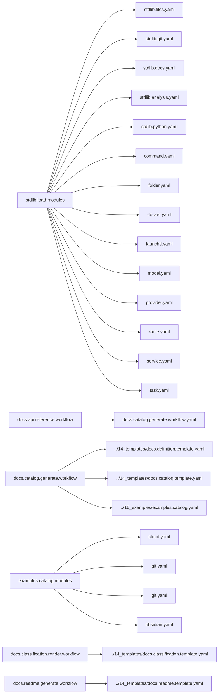

<!-- Generated by docs.api.reference; do not edit. -->
# YAML API Reference

This reference is generated by the `docs.api.reference.workflow` YAML workflow. It describes the
standard library, runnable examples, and the documentation workflow itself.

Regenerate or verify committed output from `06_workflows/yaml/`:

```bash
python interpreter.py 06_workflows/docs.api.reference.workflow.yaml docs.api.reference.workflow --output_dir=docs --mode=write
python interpreter.py 06_workflows/docs.api.reference.workflow.yaml docs.api.reference.workflow --output_dir=docs --mode=check
```

See the [definition authoring schema](schema.md) for metadata and composition fields.

## Definitions

| Definition | ID | Source | Tags |
| --- | --- | --- | --- |
| [Abstract Base](stdlib.base.md) | `stdlib.base` | `02_core/runtimes/yaml/definitions/stdlib.yaml` | core, abstract |
| [Load Standard Library Modules](stdlib.load-modules.md) | `stdlib.load-modules` | `02_core/runtimes/yaml/definitions/stdlib.yaml` | core, modules |
| [Run Command](stdlib.run-command.md) | `stdlib.run-command` | `02_core/runtimes/yaml/definitions/stdlib.yaml` | shell |
| [Clean Workspace](stdlib.clean-workspace.md) | `stdlib.clean-workspace` | `02_core/runtimes/yaml/definitions/stdlib.yaml` | files, destructive |
| [Logger](stdlib.logger.md) | `stdlib.logger` | `02_core/runtimes/yaml/definitions/stdlib.yaml` | logging |
| [Write Text File](stdlib.files.write-text.md) | `stdlib.files.write-text` | `02_core/runtimes/yaml/definitions/stdlib.files.yaml` | files, templates |
| [Create Directory](stdlib.files.create-directory.md) | `stdlib.files.create-directory` | `02_core/runtimes/yaml/definitions/stdlib.files.yaml` | files |
| [Write Text File (input form)](stdlib.files.write.md) | `stdlib.files.write` | `02_core/runtimes/yaml/definitions/stdlib.files.yaml` | files, templates |
| [Initialize Current Git Workspace](stdlib.git.init-current-workspace.md) | `stdlib.git.init-current-workspace` | `02_core/runtimes/yaml/definitions/stdlib.git.yaml` | git |
| [Write Python Gitignore](stdlib.git.gitignore-python.md) | `stdlib.git.gitignore-python` | `02_core/runtimes/yaml/definitions/stdlib.git.yaml` | git, files, templates |
| [Create GitHub Repository](stdlib.git.create-github-repository.md) | `stdlib.git.create-github-repository` | `02_core/runtimes/yaml/definitions/stdlib.git.yaml` | git, github |
| [Prune Generated Definition Pages](stdlib.docs.prune-definition-pages.md) | `stdlib.docs.prune-definition-pages` | `02_core/runtimes/yaml/definitions/stdlib.docs.yaml` | documentation, files |
| [Analysis Base](stdlib.analysis.base.md) | `stdlib.analysis.base` | `02_core/runtimes/yaml/definitions/stdlib.analysis.yaml` | analysis, abstract |
| [Write Analysis Snapshot](stdlib.analysis.snapshot.md) | `stdlib.analysis.snapshot` | `02_core/runtimes/yaml/definitions/stdlib.analysis.yaml` | analysis, intelligence |
| [Verify Definition References](stdlib.analysis.verify-references.md) | `stdlib.analysis.verify-references` | `02_core/runtimes/yaml/definitions/stdlib.analysis.yaml` | analysis, validation |
| [Python Barrel - __init__.py Template](stdlib.python.barrel.template.md) | `stdlib.python.barrel.template` | `02_core/runtimes/yaml/definitions/stdlib.python.yaml` | python, template |
| [Generate Python Barrel](stdlib.python.barrel.md) | `stdlib.python.barrel` | `02_core/runtimes/yaml/definitions/stdlib.python.yaml` | python, generator |
| [Abstract Command Base](command.base.md) | `command.base` | `02_core/runtimes/yaml/definitions/command.yaml` | command, abstract |
| [Run Task](command.task.run.md) | `command.task.run` | `02_core/runtimes/yaml/definitions/command.yaml` | command |
| [Run a Service Lifecycle Action](command.service.action.md) | `command.service.action` | `02_core/runtimes/yaml/definitions/command.yaml` | command |
| [Route an Intent through the Router](command.route.md) | `command.route` | `02_core/runtimes/yaml/definitions/command.yaml` | command |
| [Folder Scaffold Base](folder.base.md) | `folder.base` | `02_core/runtimes/yaml/definitions/folder.yaml` | folder, abstract |
| [Dockerfile Mixin](dockerfile.base.md) | `dockerfile.base` | `02_core/runtimes/yaml/definitions/docker.yaml` | docker, dockerfile, abstract |
| [Docker Compose Mixin](compose.base.md) | `compose.base` | `02_core/runtimes/yaml/definitions/docker.yaml` | docker, compose, abstract |
| [Docker Service (Compose + Dockerfile)](docker.base.md) | `docker.base` | `02_core/runtimes/yaml/definitions/docker.yaml` | docker, abstract |
| [Build Docker Image](docker.build.md) | `docker.build` | `02_core/runtimes/yaml/definitions/docker.yaml` | docker, build |
| [Docker Compose Up](compose.up.md) | `compose.up` | `02_core/runtimes/yaml/definitions/docker.yaml` | docker, compose, lifecycle |
| [Docker Compose Down](compose.down.md) | `compose.down` | `02_core/runtimes/yaml/definitions/docker.yaml` | docker, compose, lifecycle |
| [Docker Compose Status](compose.status.md) | `compose.status` | `02_core/runtimes/yaml/definitions/docker.yaml` | docker, compose, lifecycle |
| [Docker Compose Logs](compose.logs.md) | `compose.logs` | `02_core/runtimes/yaml/definitions/docker.yaml` | docker, compose, lifecycle |
| [Scaffold All Docker Services](docker.generate-all.md) | `docker.generate-all` | `02_core/runtimes/yaml/definitions/docker.yaml` | docker, workflow |
| [launchd Job Base](launchd.base.md) | `launchd.base` | `02_core/runtimes/yaml/definitions/launchd.yaml` | launchd, abstract |
| [Generate launchd Plists](launchd.generate-plist.md) | `launchd.generate-plist` | `02_core/runtimes/yaml/definitions/launchd.yaml` | launchd, workflow |
| [launchd Lifecycle Base](launchd.lifecycle.base.md) | `launchd.lifecycle.base` | `02_core/runtimes/yaml/definitions/launchd.yaml` | launchd, lifecycle, abstract |
| [Install LaunchAgent](launchd.install.md) | `launchd.install` | `02_core/runtimes/yaml/definitions/launchd.yaml` | launchd, lifecycle |
| [Uninstall LaunchAgent](launchd.uninstall.md) | `launchd.uninstall` | `02_core/runtimes/yaml/definitions/launchd.yaml` | launchd, lifecycle |
| [Enable LaunchAgent](launchd.enable.md) | `launchd.enable` | `02_core/runtimes/yaml/definitions/launchd.yaml` | launchd, lifecycle |
| [Disable LaunchAgent](launchd.disable.md) | `launchd.disable` | `02_core/runtimes/yaml/definitions/launchd.yaml` | launchd, lifecycle |
| [Start LaunchAgent](launchd.start.md) | `launchd.start` | `02_core/runtimes/yaml/definitions/launchd.yaml` | launchd, lifecycle |
| [Stop LaunchAgent](launchd.stop.md) | `launchd.stop` | `02_core/runtimes/yaml/definitions/launchd.yaml` | launchd, lifecycle |
| [Print LaunchAgent Status](launchd.status.md) | `launchd.status` | `02_core/runtimes/yaml/definitions/launchd.yaml` | launchd, lifecycle |
| [LLM Model Record](model.base.md) | `model.base` | `02_core/runtimes/yaml/definitions/model.yaml` | model, abstract |
| [LLM Provider Record](provider.base.md) | `provider.base` | `02_core/runtimes/yaml/definitions/provider.yaml` | provider, abstract |
| [Routable Definition Base](route.base.md) | `route.base` | `02_core/runtimes/yaml/definitions/route.yaml` | route, abstract |
| [Echo Route (smoke test)](route.echo.md) | `route.echo` | `02_core/runtimes/yaml/definitions/route.yaml` | route |
| [Service Abstraction Base](service.base.md) | `service.base` | `02_core/runtimes/yaml/definitions/service.yaml` | service, abstract |
| [Docker Backend Action Map](service.docker.mixin.md) | `service.docker.mixin` | `02_core/runtimes/yaml/definitions/service.yaml` | service, docker, abstract |
| [Launchd Backend Action Map](service.launchd.mixin.md) | `service.launchd.mixin` | `02_core/runtimes/yaml/definitions/service.yaml` | service, launchd, abstract |
| [Ollama Service (launchd backend)](service.ollama.md) | `service.ollama` | `02_core/runtimes/yaml/definitions/service.yaml` | service, launchd |
| [Caffienate Service (launchd backend)](service.caffienate.md) | `service.caffienate` | `02_core/runtimes/yaml/definitions/service.yaml` | service, launchd |
| [LM Studio Service (launchd backend)](service.lm-studio.md) | `service.lm-studio` | `02_core/runtimes/yaml/definitions/service.yaml` | service, launchd |
| [Postgres Service (docker backend)](service.postgres.md) | `service.postgres` | `02_core/runtimes/yaml/definitions/service.yaml` | service, docker |
| [Redis Service (docker backend)](service.redis.md) | `service.redis` | `02_core/runtimes/yaml/definitions/service.yaml` | service, docker |
| [Neo4j Service (docker backend)](service.neo4j.md) | `service.neo4j` | `02_core/runtimes/yaml/definitions/service.yaml` | service, docker |
| [Task base](task.base.md) | `task.base` | `02_core/runtimes/yaml/definitions/task.yaml` | task, abstract |
| [JSON Schema Base](schemas.base.md) | `schemas.base` | `02_core/runtimes/yaml/definitions/schemas.yaml` | schema, abstract |
| [Generate Schema JSON](schemas.generate-json.md) | `schemas.generate-json` | `02_core/runtimes/yaml/definitions/schemas.yaml` | schema, workflow |
| [Classification Audit Finding](audit.classification_finding.schema.md) | `audit.classification_finding.schema` | `01_schemas/audit.classification_finding.schema.yaml` | schema, audit |
| [Dispatch Request Envelope](dispatch.request.schema.md) | `dispatch.request.schema` | `01_schemas/dispatch.request.schema.yaml` | schema, dispatch |
| [Dispatch Response Envelope](dispatch.response.schema.md) | `dispatch.response.schema` | `01_schemas/dispatch.response.schema.yaml` | schema, dispatch |
| [Harness Stream Event](harness.stream_event.schema.md) | `harness.stream_event.schema` | `01_schemas/harness.stream_event.schema.yaml` | schema, harness |
| [Tool Invocation](tool.invocation.schema.md) | `tool.invocation.schema` | `01_schemas/tool.invocation.schema.yaml` | schema, tool |
| [Audit classification boundaries and ownership](audit.classifications.scan.workflow.md) | `audit.classifications.scan.workflow` | `06_workflows/audit.classifications.scan.workflow.yaml` | workflow |
| [Regenerate All Workflows Barrels](barrels.regenerate.workflow.md) | `barrels.regenerate.workflow` | `06_workflows/barrels.regenerate.workflow.yaml` | python, generator, workflow |
| [Regenerate workflows.yaml Bucket Barrels](barrels.regenerate.yaml-runtime.md) | `barrels.regenerate.yaml-runtime` | `06_workflows/barrels.regenerate.workflow.yaml` | python, generator, workflow |
| [YAML API Reference Build](docs.api.reference.workflow.md) | `docs.api.reference.workflow` | `06_workflows/docs.api.reference.workflow.yaml` | documentation, workflow |
| [API Documentation Catalog Sources](docs.catalog.generate.workflow.md) | `docs.catalog.generate.workflow` | `06_workflows/docs.catalog.generate.workflow.yaml` | documentation, modules |
| [Docs - Relationship Graph Component](docs.definition.template.component-relationship-graph.md) | `docs.definition.template.component-relationship-graph` | `14_templates/docs.definition.template.yaml` | documentation, template, component |
| [Docs - Definition Page Template](docs.definition.template.definition.md) | `docs.definition.template.definition` | `14_templates/docs.definition.template.yaml` | documentation, template |
| [Docs - Index Page Template](docs.catalog.template.index.md) | `docs.catalog.template.index` | `14_templates/docs.catalog.template.yaml` | documentation, template |
| [Docs - Authoring Schema Page Template](docs.catalog.template.schema.md) | `docs.catalog.template.schema` | `14_templates/docs.catalog.template.yaml` | documentation, template |
| [Example Catalog Modules](examples.catalog.modules.md) | `examples.catalog.modules` | `15_examples/examples.catalog.yaml` | examples, modules |
| [Git Information](cloud.mixin.git-info.md) | `cloud.mixin.git-info` | `15_examples/cloud.yaml` | mixin, git, deployment |
| [Timestamp](cloud.mixin.timestamp.md) | `cloud.mixin.timestamp` | `15_examples/cloud.yaml` | mixin, deployment |
| [Cloud Deployer](cloud.deployer.md) | `cloud.deployer` | `15_examples/cloud.yaml` | example, deployment, cloud |
| [Initialize Git Example](git.init.md) | `git.init` | `15_examples/git.yaml` | example, git |
| [GitHub Repository Example](git.github.md) | `git.github` | `15_examples/git.yaml` | example, git, github |
| [Gitignore Template Example](git.gitignore.md) | `git.gitignore` | `15_examples/git.yaml` | example, git, templates |
| [Obsidian Daily Note Template](obsidian.template.md) | `obsidian.template` | `15_examples/obsidian.yaml` | example, obsidian, templates |
| [Render Classification Docs](docs.classification.render.workflow.md) | `docs.classification.render.workflow` | `06_workflows/docs.classification.render.workflow.yaml` | documentation, workflow, classification |
| [Docs - Classification Audit](docs.classification.audit.template.md) | `docs.classification.audit.template` | `14_templates/docs.classification.template.yaml` | documentation, template, classification |
| [Docs - Classification Remediation Workflow](docs.classification.remediation-workflow.template.md) | `docs.classification.remediation-workflow.template` | `14_templates/docs.classification.template.yaml` | documentation, template, classification |
| [Generate Documentation](docs.generate.workflow.md) | `docs.generate.workflow` | `06_workflows/docs.generate.workflow.yaml` | workflow |
| [Build Repo README](docs.readme.generate.workflow.md) | `docs.readme.generate.workflow` | `06_workflows/docs.readme.generate.workflow.yaml` | documentation, workflow |
| [Docs - Repo README Template](docs.readme.template.md) | `docs.readme.template` | `14_templates/docs.readme.template.yaml` | documentation, template |
| [Sweep and embed project files into the vector store](embeddings.sweep.workflow.md) | `embeddings.sweep.workflow` | `06_workflows/embeddings.sweep.workflow.yaml` | workflow |
| [Classify files for audit and remediation](files.classify.workflow.md) | `files.classify.workflow` | `06_workflows/files.classify.workflow.yaml` | workflow |
| [Scan Boundary Violations](audit.boundary_violations.scan.task.md) | `audit.boundary_violations.scan.task` | `07_tasks/audit.boundary_violations.scan.task.yaml` | task |
| [Fetch readable text from a URL or search topic](browser.fetch.text.task.md) | `browser.fetch.text.task` | `07_tasks/browser.fetch.text.task.yaml` | task |
| [Build file classification manifest](classify.manifest.build.task.md) | `classify.manifest.build.task` | `07_tasks/classify.manifest.build.task.yaml` | task |
| [Return broad media class for a path](classify.media.class_for_path.task.md) | `classify.media.class_for_path.task` | `07_tasks/classify.media.class_for_path.task.yaml` | task |
| [Classify a file by media type and destination](classify.media.file.task.md) | `classify.media.file.task` | `07_tasks/classify.media.file.task.yaml` | task |
| [Chunk a file into embeddable text segments](embeddings.chunker.chunk_file.task.md) | `embeddings.chunker.chunk_file.task` | `07_tasks/embeddings.chunker.chunk_file.task.yaml` | task |
| [Generate an embedding vector for text](embeddings.embed.text.task.md) | `embeddings.embed.text.task` | `07_tasks/embeddings.embed.text.task.yaml` | task |
| [Query the local knowledge base](embeddings.query.search.task.md) | `embeddings.query.search.task` | `07_tasks/embeddings.query.search.task.yaml` | task |
| [Collect indexable files for embedding sweep](embeddings.sweep.collect_files.task.md) | `embeddings.sweep.collect_files.task` | `07_tasks/embeddings.sweep.collect_files.task.yaml` | task |
| [Compute MD5 hash of a file](embeddings.sweep.file_hash.task.md) | `embeddings.sweep.file_hash.task` | `07_tasks/embeddings.sweep.file_hash.task.yaml` | task |
| [Load the embedding sweep manifest](embeddings.sweep.load_manifest.task.md) | `embeddings.sweep.load_manifest.task` | `07_tasks/embeddings.sweep.load_manifest.task.yaml` | task |
| [Persist the embedding sweep manifest](embeddings.sweep.save_manifest.task.md) | `embeddings.sweep.save_manifest.task` | `07_tasks/embeddings.sweep.save_manifest.task.yaml` | task |
| [Iterate files in a directory tree](files.iter.task.md) | `files.iter.task` | `07_tasks/files.iter.task.yaml` | task |
| [Compute SHA-256 hash of a file](files.sha256.task.md) | `files.sha256.task` | `07_tasks/files.sha256.task.yaml` | task |
| [Write data to a JSON file](files.write_json.task.md) | `files.write_json.task` | `07_tasks/files.write_json.task.yaml` | task |
| [Classify an image by semantic type](image.classify.task.md) | `image.classify.task` | `07_tasks/image.classify.task.yaml` | task |
| [Extract dominant color palette from an image](image.color.dominant.task.md) | `image.color.dominant.task` | `07_tasks/image.color.dominant.task.yaml` | task |
| [Extract image file metadata](image.meta.extract.task.md) | `image.meta.extract.task` | `07_tasks/image.meta.extract.task.yaml` | task |
| [Assess image quality](image.quality.extract.task.md) | `image.quality.extract.task` | `07_tasks/image.quality.extract.task.yaml` | task |
| [Detect content regions in an image](image.regions.extract.task.md) | `image.regions.extract.task` | `07_tasks/image.regions.extract.task.yaml` | task |
| [Extract OCR text from an image](image.text_ocr.extract.task.md) | `image.text_ocr.extract.task` | `07_tasks/image.text_ocr.extract.task.yaml` | task |
| [Infer document type from filename](metadata.doc_type.task.md) | `metadata.doc_type.task` | `07_tasks/metadata.doc_type.task.yaml` | task |
| [Infer source origin from file path](metadata.source_guess.task.md) | `metadata.source_guess.task` | `07_tasks/metadata.source_guess.task.yaml` | task |
| [Get PDF page count](pdf.meta.page_count.task.md) | `pdf.meta.page_count.task` | `07_tasks/pdf.meta.page_count.task.yaml` | task |
| [Fetch and summarize content through a local model](research.local.summarize.task.md) | `research.local.summarize.task` | `07_tasks/research.local.summarize.task.yaml` | task |
| [Run local test suite](shell.tests.run.task.md) | `shell.tests.run.task` | `07_tasks/shell.tests.run.task.yaml` | task |
| [Format a markdown file using a local LM Studio model](text.markdown.format.task.md) | `text.markdown.format.task` | `07_tasks/text.markdown.format.task.yaml` | task |
| [Casbin Authorization Service](docker.casbin-service.md) | `docker.casbin-service` | `09_docker/casbin-service.yaml` | docker, auth |
| [ClamAV Service](docker.clamav.md) | `docker.clamav` | `09_docker/clamav.yaml` | docker, document |
| [FastAPI Service](docker.fastapi.md) | `docker.fastapi` | `09_docker/fastapi.yaml` | docker, workers |
| [Gitea Service](docker.gitea.md) | `docker.gitea` | `09_docker/gitea.yaml` | docker, dev |
| [Grafana Service](docker.grafana.md) | `docker.grafana` | `09_docker/grafana.yaml` | docker, observability |
| [GROBID Service](docker.grobid.md) | `docker.grobid` | `09_docker/grobid.yaml` | docker, document |
| [Jaeger Service](docker.jaeger.md) | `docker.jaeger` | `09_docker/jaeger.yaml` | docker, observability |
| [Jupyter Service](docker.jupyter.md) | `docker.jupyter` | `09_docker/jupyter.yaml` | docker, dev |
| [Keycloak Service](docker.keycloak.md) | `docker.keycloak` | `09_docker/keycloak.yaml` | docker, auth |
| [LibreOffice Conversion Service](docker.libreoffice.md) | `docker.libreoffice` | `09_docker/libreoffice.yaml` | docker, document |
| [MinIO Service](docker.minio.md) | `docker.minio` | `09_docker/minio.yaml` | docker, storage |
| [n8n Service](docker.n8n.md) | `docker.n8n` | `09_docker/n8n.yaml` | docker, workers |
| [Neo4j Service](docker.neo4j.md) | `docker.neo4j` | `09_docker/neo4j.yaml` | docker, graph |
| [Ollama Service](docker.ollama.md) | `docker.ollama` | `09_docker/ollama.yaml` | docker, ai |
| [Open WebUI Service](docker.open-webui.md) | `docker.open-webui` | `09_docker/open-webui.yaml` | docker, ai |
| [OpenFGA Service](docker.openfga.md) | `docker.openfga` | `09_docker/openfga.yaml` | docker, auth |
| [OpenSearch Dashboards Service](docker.opensearch-dashboards.md) | `docker.opensearch-dashboards` | `09_docker/opensearch-dashboards.yaml` | docker, search |
| [OpenSearch Service](docker.opensearch.md) | `docker.opensearch` | `09_docker/opensearch.yaml` | docker, search |
| [pgvector Service](docker.pgvector.md) | `docker.pgvector` | `09_docker/pgvector.yaml` | docker, database |
| [Playwright Worker Service](docker.playwright-worker.md) | `docker.playwright-worker` | `09_docker/playwright-worker.yaml` | docker, document |
| [PostgreSQL Service](docker.postgres.md) | `docker.postgres` | `09_docker/postgres.yaml` | docker, databases |
| [Prometheus Service](docker.prometheus.md) | `docker.prometheus` | `09_docker/prometheus.yaml` | docker, observability |
| [Qdrant Service](docker.qdrant.md) | `docker.qdrant` | `09_docker/qdrant.yaml` | docker, vector |
| [Redis Service](docker.redis.md) | `docker.redis` | `09_docker/redis.yaml` | docker, databases |
| [Temporal UI Service](docker.temporal-ui.md) | `docker.temporal-ui` | `09_docker/temporal-ui.yaml` | docker, workers |
| [Temporal Service](docker.temporal.md) | `docker.temporal` | `09_docker/temporal.yaml` | docker, workers |
| [Tesseract OCR Service](docker.tesseract-ocr.md) | `docker.tesseract-ocr` | `09_docker/tesseract-ocr.yaml` | docker, document |
| [Apache Tika Service](docker.tika.md) | `docker.tika` | `09_docker/tika.yaml` | docker, document |
| [Traefik Service](docker.traefik.md) | `docker.traefik` | `09_docker/traefik.yaml` | docker, proxy |
| [Unstructured Service](docker.unstructured.md) | `docker.unstructured` | `09_docker/unstructured.yaml` | docker, document |
| [Weaviate Service](docker.weaviate.md) | `docker.weaviate` | `09_docker/weaviate.yaml` | docker, vector |
| [Content-Graph Worker Service](docker.worker.md) | `docker.worker` | `09_docker/worker.yaml` | docker, workers |
| [launchd - Caffeinate](launchd.caffienate.md) | `launchd.caffienate` | `09_launchd/caffienate.yaml` | launchd, system |
| [launchd - Docker](launchd.docker.md) | `launchd.docker` | `09_launchd/docker.yaml` | launchd, runtime |
| [launchd - LM Studio](launchd.lm-studio.md) | `launchd.lm-studio` | `09_launchd/lm_studio.yaml` | launchd, ai |
| [launchd - Ollama](launchd.ollama.md) | `launchd.ollama` | `09_launchd/ollama.yaml` | launchd, ai |
| [claude-haiku-4-5](model.claude-haiku-4-5.md) | `model.claude-haiku-4-5` | `13_models/model.claude-haiku-4-5.yaml` | model |
| [claude-opus-4-7](model.claude-opus-4-7.md) | `model.claude-opus-4-7` | `13_models/model.claude-opus-4-7.yaml` | model |
| [claude-sonnet-4-6](model.claude-sonnet-4-6.md) | `model.claude-sonnet-4-6` | `13_models/model.claude-sonnet-4-6.yaml` | model |
| [deepseek-r1](model.deepseek-r1.md) | `model.deepseek-r1` | `13_models/model.deepseek-r1.yaml` | model |
| [gemma2](model.gemma2.md) | `model.gemma2` | `13_models/model.gemma2.yaml` | model |
| [gemma3](model.gemma3.md) | `model.gemma3` | `13_models/model.gemma3.yaml` | model |
| [llama3.1](model.llama3.1.md) | `model.llama3.1` | `13_models/model.llama3.1.yaml` | model |
| [llama3.2-vision](model.llama3.2-vision.md) | `model.llama3.2-vision` | `13_models/model.llama3.2-vision.yaml` | model |
| [llama3.2](model.llama3.2.md) | `model.llama3.2` | `13_models/model.llama3.2.yaml` | model |
| [llama3](model.llama3.md) | `model.llama3` | `13_models/model.llama3.yaml` | model |
| [mistral](model.mistral.md) | `model.mistral` | `13_models/model.mistral.yaml` | model |
| [nomic-embed-text](model.nomic-embed-text.md) | `model.nomic-embed-text` | `13_models/model.nomic-embed-text.yaml` | model |
| [qwen2.5](model.qwen2.5.md) | `model.qwen2.5` | `13_models/model.qwen2.5.yaml` | model |
| [qwen3](model.qwen3.md) | `model.qwen3` | `13_models/model.qwen3.yaml` | model |
| [claude](provider.claude.md) | `provider.claude` | `13_providers/provider.claude.yaml` | provider |
| [gemini](provider.gemini.md) | `provider.gemini` | `13_providers/provider.gemini.yaml` | provider |
| [lmstudio](provider.lmstudio.md) | `provider.lmstudio` | `13_providers/provider.lmstudio.yaml` | provider |
| [ollama](provider.ollama.md) | `provider.ollama` | `13_providers/provider.ollama.yaml` | provider |
| [openai](provider.openai.md) | `provider.openai` | `13_providers/provider.openai.yaml` | provider |
| [Hello Polyglot](examples.hello-polyglot.md) | `examples.hello-polyglot` | `<raw>` | - |
| [Hello Python](examples.hello-python.md) | `examples.hello-python` | `<raw>` | - |
| [Hello Shell](examples.hello-shell.md) | `examples.hello-shell` | `<raw>` | - |
| [Format Markdown for Compliance](tasks.format-markdown.md) | `tasks.format-markdown` | `<raw>` | - |
| [tasks.generate-title-from-text](tasks.generate-title-from-text.md) | `tasks.generate-title-from-text` | `<raw>` | - |
| [tasks.research-summary](tasks.research-summary.md) | `tasks.research-summary` | `<raw>` | - |
| [Spec promotion — Final stage](tasks.spec-promotion.final.md) | `tasks.spec-promotion.final` | `<raw>` | - |
| [Spec promotion — Prompts stage](tasks.spec-promotion.prompts.md) | `tasks.spec-promotion.prompts` | `<raw>` | - |
| [Spec promotion — Requirements stage](tasks.spec-promotion.requirements.md) | `tasks.spec-promotion.requirements` | `<raw>` | - |
| [Spec promotion — Research stage](tasks.spec-promotion.research.md) | `tasks.spec-promotion.research` | `<raw>` | - |
| [Spec promotion — Tasks stage](tasks.spec-promotion.tasks.md) | `tasks.spec-promotion.tasks` | `<raw>` | - |
| [tasks.vision.layout](tasks.vision.layout.md) | `tasks.vision.layout` | `<raw>` | - |
| [tasks.vision.overview](tasks.vision.overview.md) | `tasks.vision.overview` | `<raw>` | - |
| [tasks.vision.style](tasks.vision.style.md) | `tasks.vision.style` | `<raw>` | - |
| [tasks.vision.visible-text](tasks.vision.visible-text.md) | `tasks.vision.visible-text` | `<raw>` | - |


## Tags

### abstract

- [Abstract Base](stdlib.base.md) (`stdlib.base`)
- [Analysis Base](stdlib.analysis.base.md) (`stdlib.analysis.base`)
- [Abstract Command Base](command.base.md) (`command.base`)
- [Folder Scaffold Base](folder.base.md) (`folder.base`)
- [Dockerfile Mixin](dockerfile.base.md) (`dockerfile.base`)
- [Docker Compose Mixin](compose.base.md) (`compose.base`)
- [Docker Service (Compose + Dockerfile)](docker.base.md) (`docker.base`)
- [launchd Job Base](launchd.base.md) (`launchd.base`)
- [launchd Lifecycle Base](launchd.lifecycle.base.md) (`launchd.lifecycle.base`)
- [LLM Model Record](model.base.md) (`model.base`)
- [LLM Provider Record](provider.base.md) (`provider.base`)
- [Routable Definition Base](route.base.md) (`route.base`)
- [Service Abstraction Base](service.base.md) (`service.base`)
- [Docker Backend Action Map](service.docker.mixin.md) (`service.docker.mixin`)
- [Launchd Backend Action Map](service.launchd.mixin.md) (`service.launchd.mixin`)
- [Task base](task.base.md) (`task.base`)
- [JSON Schema Base](schemas.base.md) (`schemas.base`)


### ai

- [Ollama Service](docker.ollama.md) (`docker.ollama`)
- [Open WebUI Service](docker.open-webui.md) (`docker.open-webui`)
- [launchd - LM Studio](launchd.lm-studio.md) (`launchd.lm-studio`)
- [launchd - Ollama](launchd.ollama.md) (`launchd.ollama`)


### analysis

- [Analysis Base](stdlib.analysis.base.md) (`stdlib.analysis.base`)
- [Write Analysis Snapshot](stdlib.analysis.snapshot.md) (`stdlib.analysis.snapshot`)
- [Verify Definition References](stdlib.analysis.verify-references.md) (`stdlib.analysis.verify-references`)


### audit

- [Classification Audit Finding](audit.classification_finding.schema.md) (`audit.classification_finding.schema`)


### auth

- [Casbin Authorization Service](docker.casbin-service.md) (`docker.casbin-service`)
- [Keycloak Service](docker.keycloak.md) (`docker.keycloak`)
- [OpenFGA Service](docker.openfga.md) (`docker.openfga`)


### build

- [Build Docker Image](docker.build.md) (`docker.build`)


### classification

- [Render Classification Docs](docs.classification.render.workflow.md) (`docs.classification.render.workflow`)
- [Docs - Classification Audit](docs.classification.audit.template.md) (`docs.classification.audit.template`)
- [Docs - Classification Remediation Workflow](docs.classification.remediation-workflow.template.md) (`docs.classification.remediation-workflow.template`)


### cloud

- [Cloud Deployer](cloud.deployer.md) (`cloud.deployer`)


### command

- [Abstract Command Base](command.base.md) (`command.base`)
- [Run Task](command.task.run.md) (`command.task.run`)
- [Run a Service Lifecycle Action](command.service.action.md) (`command.service.action`)
- [Route an Intent through the Router](command.route.md) (`command.route`)


### component

- [Docs - Relationship Graph Component](docs.definition.template.component-relationship-graph.md) (`docs.definition.template.component-relationship-graph`)


### compose

- [Docker Compose Mixin](compose.base.md) (`compose.base`)
- [Docker Compose Up](compose.up.md) (`compose.up`)
- [Docker Compose Down](compose.down.md) (`compose.down`)
- [Docker Compose Status](compose.status.md) (`compose.status`)
- [Docker Compose Logs](compose.logs.md) (`compose.logs`)


### core

- [Abstract Base](stdlib.base.md) (`stdlib.base`)
- [Load Standard Library Modules](stdlib.load-modules.md) (`stdlib.load-modules`)


### database

- [pgvector Service](docker.pgvector.md) (`docker.pgvector`)


### databases

- [PostgreSQL Service](docker.postgres.md) (`docker.postgres`)
- [Redis Service](docker.redis.md) (`docker.redis`)


### deployment

- [Git Information](cloud.mixin.git-info.md) (`cloud.mixin.git-info`)
- [Timestamp](cloud.mixin.timestamp.md) (`cloud.mixin.timestamp`)
- [Cloud Deployer](cloud.deployer.md) (`cloud.deployer`)


### destructive

- [Clean Workspace](stdlib.clean-workspace.md) (`stdlib.clean-workspace`)


### dev

- [Gitea Service](docker.gitea.md) (`docker.gitea`)
- [Jupyter Service](docker.jupyter.md) (`docker.jupyter`)


### dispatch

- [Dispatch Request Envelope](dispatch.request.schema.md) (`dispatch.request.schema`)
- [Dispatch Response Envelope](dispatch.response.schema.md) (`dispatch.response.schema`)


### docker

- [Dockerfile Mixin](dockerfile.base.md) (`dockerfile.base`)
- [Docker Compose Mixin](compose.base.md) (`compose.base`)
- [Docker Service (Compose + Dockerfile)](docker.base.md) (`docker.base`)
- [Build Docker Image](docker.build.md) (`docker.build`)
- [Docker Compose Up](compose.up.md) (`compose.up`)
- [Docker Compose Down](compose.down.md) (`compose.down`)
- [Docker Compose Status](compose.status.md) (`compose.status`)
- [Docker Compose Logs](compose.logs.md) (`compose.logs`)
- [Scaffold All Docker Services](docker.generate-all.md) (`docker.generate-all`)
- [Docker Backend Action Map](service.docker.mixin.md) (`service.docker.mixin`)
- [Postgres Service (docker backend)](service.postgres.md) (`service.postgres`)
- [Redis Service (docker backend)](service.redis.md) (`service.redis`)
- [Neo4j Service (docker backend)](service.neo4j.md) (`service.neo4j`)
- [Casbin Authorization Service](docker.casbin-service.md) (`docker.casbin-service`)
- [ClamAV Service](docker.clamav.md) (`docker.clamav`)
- [FastAPI Service](docker.fastapi.md) (`docker.fastapi`)
- [Gitea Service](docker.gitea.md) (`docker.gitea`)
- [Grafana Service](docker.grafana.md) (`docker.grafana`)
- [GROBID Service](docker.grobid.md) (`docker.grobid`)
- [Jaeger Service](docker.jaeger.md) (`docker.jaeger`)
- [Jupyter Service](docker.jupyter.md) (`docker.jupyter`)
- [Keycloak Service](docker.keycloak.md) (`docker.keycloak`)
- [LibreOffice Conversion Service](docker.libreoffice.md) (`docker.libreoffice`)
- [MinIO Service](docker.minio.md) (`docker.minio`)
- [n8n Service](docker.n8n.md) (`docker.n8n`)
- [Neo4j Service](docker.neo4j.md) (`docker.neo4j`)
- [Ollama Service](docker.ollama.md) (`docker.ollama`)
- [Open WebUI Service](docker.open-webui.md) (`docker.open-webui`)
- [OpenFGA Service](docker.openfga.md) (`docker.openfga`)
- [OpenSearch Dashboards Service](docker.opensearch-dashboards.md) (`docker.opensearch-dashboards`)
- [OpenSearch Service](docker.opensearch.md) (`docker.opensearch`)
- [pgvector Service](docker.pgvector.md) (`docker.pgvector`)
- [Playwright Worker Service](docker.playwright-worker.md) (`docker.playwright-worker`)
- [PostgreSQL Service](docker.postgres.md) (`docker.postgres`)
- [Prometheus Service](docker.prometheus.md) (`docker.prometheus`)
- [Qdrant Service](docker.qdrant.md) (`docker.qdrant`)
- [Redis Service](docker.redis.md) (`docker.redis`)
- [Temporal UI Service](docker.temporal-ui.md) (`docker.temporal-ui`)
- [Temporal Service](docker.temporal.md) (`docker.temporal`)
- [Tesseract OCR Service](docker.tesseract-ocr.md) (`docker.tesseract-ocr`)
- [Apache Tika Service](docker.tika.md) (`docker.tika`)
- [Traefik Service](docker.traefik.md) (`docker.traefik`)
- [Unstructured Service](docker.unstructured.md) (`docker.unstructured`)
- [Weaviate Service](docker.weaviate.md) (`docker.weaviate`)
- [Content-Graph Worker Service](docker.worker.md) (`docker.worker`)


### dockerfile

- [Dockerfile Mixin](dockerfile.base.md) (`dockerfile.base`)


### document

- [ClamAV Service](docker.clamav.md) (`docker.clamav`)
- [GROBID Service](docker.grobid.md) (`docker.grobid`)
- [LibreOffice Conversion Service](docker.libreoffice.md) (`docker.libreoffice`)
- [Playwright Worker Service](docker.playwright-worker.md) (`docker.playwright-worker`)
- [Tesseract OCR Service](docker.tesseract-ocr.md) (`docker.tesseract-ocr`)
- [Apache Tika Service](docker.tika.md) (`docker.tika`)
- [Unstructured Service](docker.unstructured.md) (`docker.unstructured`)


### documentation

- [Prune Generated Definition Pages](stdlib.docs.prune-definition-pages.md) (`stdlib.docs.prune-definition-pages`)
- [YAML API Reference Build](docs.api.reference.workflow.md) (`docs.api.reference.workflow`)
- [API Documentation Catalog Sources](docs.catalog.generate.workflow.md) (`docs.catalog.generate.workflow`)
- [Docs - Relationship Graph Component](docs.definition.template.component-relationship-graph.md) (`docs.definition.template.component-relationship-graph`)
- [Docs - Definition Page Template](docs.definition.template.definition.md) (`docs.definition.template.definition`)
- [Docs - Index Page Template](docs.catalog.template.index.md) (`docs.catalog.template.index`)
- [Docs - Authoring Schema Page Template](docs.catalog.template.schema.md) (`docs.catalog.template.schema`)
- [Render Classification Docs](docs.classification.render.workflow.md) (`docs.classification.render.workflow`)
- [Docs - Classification Audit](docs.classification.audit.template.md) (`docs.classification.audit.template`)
- [Docs - Classification Remediation Workflow](docs.classification.remediation-workflow.template.md) (`docs.classification.remediation-workflow.template`)
- [Build Repo README](docs.readme.generate.workflow.md) (`docs.readme.generate.workflow`)
- [Docs - Repo README Template](docs.readme.template.md) (`docs.readme.template`)


### example

- [Cloud Deployer](cloud.deployer.md) (`cloud.deployer`)
- [Initialize Git Example](git.init.md) (`git.init`)
- [GitHub Repository Example](git.github.md) (`git.github`)
- [Gitignore Template Example](git.gitignore.md) (`git.gitignore`)
- [Obsidian Daily Note Template](obsidian.template.md) (`obsidian.template`)


### examples

- [Example Catalog Modules](examples.catalog.modules.md) (`examples.catalog.modules`)


### files

- [Clean Workspace](stdlib.clean-workspace.md) (`stdlib.clean-workspace`)
- [Write Text File](stdlib.files.write-text.md) (`stdlib.files.write-text`)
- [Create Directory](stdlib.files.create-directory.md) (`stdlib.files.create-directory`)
- [Write Text File (input form)](stdlib.files.write.md) (`stdlib.files.write`)
- [Write Python Gitignore](stdlib.git.gitignore-python.md) (`stdlib.git.gitignore-python`)
- [Prune Generated Definition Pages](stdlib.docs.prune-definition-pages.md) (`stdlib.docs.prune-definition-pages`)


### folder

- [Folder Scaffold Base](folder.base.md) (`folder.base`)


### generator

- [Generate Python Barrel](stdlib.python.barrel.md) (`stdlib.python.barrel`)
- [Regenerate All Workflows Barrels](barrels.regenerate.workflow.md) (`barrels.regenerate.workflow`)
- [Regenerate workflows.yaml Bucket Barrels](barrels.regenerate.yaml-runtime.md) (`barrels.regenerate.yaml-runtime`)


### git

- [Initialize Current Git Workspace](stdlib.git.init-current-workspace.md) (`stdlib.git.init-current-workspace`)
- [Write Python Gitignore](stdlib.git.gitignore-python.md) (`stdlib.git.gitignore-python`)
- [Create GitHub Repository](stdlib.git.create-github-repository.md) (`stdlib.git.create-github-repository`)
- [Git Information](cloud.mixin.git-info.md) (`cloud.mixin.git-info`)
- [Initialize Git Example](git.init.md) (`git.init`)
- [GitHub Repository Example](git.github.md) (`git.github`)
- [Gitignore Template Example](git.gitignore.md) (`git.gitignore`)


### github

- [Create GitHub Repository](stdlib.git.create-github-repository.md) (`stdlib.git.create-github-repository`)
- [GitHub Repository Example](git.github.md) (`git.github`)


### graph

- [Neo4j Service](docker.neo4j.md) (`docker.neo4j`)


### harness

- [Harness Stream Event](harness.stream_event.schema.md) (`harness.stream_event.schema`)


### intelligence

- [Write Analysis Snapshot](stdlib.analysis.snapshot.md) (`stdlib.analysis.snapshot`)


### launchd

- [launchd Job Base](launchd.base.md) (`launchd.base`)
- [Generate launchd Plists](launchd.generate-plist.md) (`launchd.generate-plist`)
- [launchd Lifecycle Base](launchd.lifecycle.base.md) (`launchd.lifecycle.base`)
- [Install LaunchAgent](launchd.install.md) (`launchd.install`)
- [Uninstall LaunchAgent](launchd.uninstall.md) (`launchd.uninstall`)
- [Enable LaunchAgent](launchd.enable.md) (`launchd.enable`)
- [Disable LaunchAgent](launchd.disable.md) (`launchd.disable`)
- [Start LaunchAgent](launchd.start.md) (`launchd.start`)
- [Stop LaunchAgent](launchd.stop.md) (`launchd.stop`)
- [Print LaunchAgent Status](launchd.status.md) (`launchd.status`)
- [Launchd Backend Action Map](service.launchd.mixin.md) (`service.launchd.mixin`)
- [Ollama Service (launchd backend)](service.ollama.md) (`service.ollama`)
- [Caffienate Service (launchd backend)](service.caffienate.md) (`service.caffienate`)
- [LM Studio Service (launchd backend)](service.lm-studio.md) (`service.lm-studio`)
- [launchd - Caffeinate](launchd.caffienate.md) (`launchd.caffienate`)
- [launchd - Docker](launchd.docker.md) (`launchd.docker`)
- [launchd - LM Studio](launchd.lm-studio.md) (`launchd.lm-studio`)
- [launchd - Ollama](launchd.ollama.md) (`launchd.ollama`)


### lifecycle

- [Docker Compose Up](compose.up.md) (`compose.up`)
- [Docker Compose Down](compose.down.md) (`compose.down`)
- [Docker Compose Status](compose.status.md) (`compose.status`)
- [Docker Compose Logs](compose.logs.md) (`compose.logs`)
- [launchd Lifecycle Base](launchd.lifecycle.base.md) (`launchd.lifecycle.base`)
- [Install LaunchAgent](launchd.install.md) (`launchd.install`)
- [Uninstall LaunchAgent](launchd.uninstall.md) (`launchd.uninstall`)
- [Enable LaunchAgent](launchd.enable.md) (`launchd.enable`)
- [Disable LaunchAgent](launchd.disable.md) (`launchd.disable`)
- [Start LaunchAgent](launchd.start.md) (`launchd.start`)
- [Stop LaunchAgent](launchd.stop.md) (`launchd.stop`)
- [Print LaunchAgent Status](launchd.status.md) (`launchd.status`)


### logging

- [Logger](stdlib.logger.md) (`stdlib.logger`)


### mixin

- [Git Information](cloud.mixin.git-info.md) (`cloud.mixin.git-info`)
- [Timestamp](cloud.mixin.timestamp.md) (`cloud.mixin.timestamp`)


### model

- [LLM Model Record](model.base.md) (`model.base`)
- [claude-haiku-4-5](model.claude-haiku-4-5.md) (`model.claude-haiku-4-5`)
- [claude-opus-4-7](model.claude-opus-4-7.md) (`model.claude-opus-4-7`)
- [claude-sonnet-4-6](model.claude-sonnet-4-6.md) (`model.claude-sonnet-4-6`)
- [deepseek-r1](model.deepseek-r1.md) (`model.deepseek-r1`)
- [gemma2](model.gemma2.md) (`model.gemma2`)
- [gemma3](model.gemma3.md) (`model.gemma3`)
- [llama3.1](model.llama3.1.md) (`model.llama3.1`)
- [llama3.2-vision](model.llama3.2-vision.md) (`model.llama3.2-vision`)
- [llama3.2](model.llama3.2.md) (`model.llama3.2`)
- [llama3](model.llama3.md) (`model.llama3`)
- [mistral](model.mistral.md) (`model.mistral`)
- [nomic-embed-text](model.nomic-embed-text.md) (`model.nomic-embed-text`)
- [qwen2.5](model.qwen2.5.md) (`model.qwen2.5`)
- [qwen3](model.qwen3.md) (`model.qwen3`)


### modules

- [Load Standard Library Modules](stdlib.load-modules.md) (`stdlib.load-modules`)
- [API Documentation Catalog Sources](docs.catalog.generate.workflow.md) (`docs.catalog.generate.workflow`)
- [Example Catalog Modules](examples.catalog.modules.md) (`examples.catalog.modules`)


### observability

- [Grafana Service](docker.grafana.md) (`docker.grafana`)
- [Jaeger Service](docker.jaeger.md) (`docker.jaeger`)
- [Prometheus Service](docker.prometheus.md) (`docker.prometheus`)


### obsidian

- [Obsidian Daily Note Template](obsidian.template.md) (`obsidian.template`)


### provider

- [LLM Provider Record](provider.base.md) (`provider.base`)
- [claude](provider.claude.md) (`provider.claude`)
- [gemini](provider.gemini.md) (`provider.gemini`)
- [lmstudio](provider.lmstudio.md) (`provider.lmstudio`)
- [ollama](provider.ollama.md) (`provider.ollama`)
- [openai](provider.openai.md) (`provider.openai`)


### proxy

- [Traefik Service](docker.traefik.md) (`docker.traefik`)


### python

- [Python Barrel - __init__.py Template](stdlib.python.barrel.template.md) (`stdlib.python.barrel.template`)
- [Generate Python Barrel](stdlib.python.barrel.md) (`stdlib.python.barrel`)
- [Regenerate All Workflows Barrels](barrels.regenerate.workflow.md) (`barrels.regenerate.workflow`)
- [Regenerate workflows.yaml Bucket Barrels](barrels.regenerate.yaml-runtime.md) (`barrels.regenerate.yaml-runtime`)


### route

- [Routable Definition Base](route.base.md) (`route.base`)
- [Echo Route (smoke test)](route.echo.md) (`route.echo`)


### runtime

- [launchd - Docker](launchd.docker.md) (`launchd.docker`)


### schema

- [JSON Schema Base](schemas.base.md) (`schemas.base`)
- [Generate Schema JSON](schemas.generate-json.md) (`schemas.generate-json`)
- [Classification Audit Finding](audit.classification_finding.schema.md) (`audit.classification_finding.schema`)
- [Dispatch Request Envelope](dispatch.request.schema.md) (`dispatch.request.schema`)
- [Dispatch Response Envelope](dispatch.response.schema.md) (`dispatch.response.schema`)
- [Harness Stream Event](harness.stream_event.schema.md) (`harness.stream_event.schema`)
- [Tool Invocation](tool.invocation.schema.md) (`tool.invocation.schema`)


### search

- [OpenSearch Dashboards Service](docker.opensearch-dashboards.md) (`docker.opensearch-dashboards`)
- [OpenSearch Service](docker.opensearch.md) (`docker.opensearch`)


### service

- [Service Abstraction Base](service.base.md) (`service.base`)
- [Docker Backend Action Map](service.docker.mixin.md) (`service.docker.mixin`)
- [Launchd Backend Action Map](service.launchd.mixin.md) (`service.launchd.mixin`)
- [Ollama Service (launchd backend)](service.ollama.md) (`service.ollama`)
- [Caffienate Service (launchd backend)](service.caffienate.md) (`service.caffienate`)
- [LM Studio Service (launchd backend)](service.lm-studio.md) (`service.lm-studio`)
- [Postgres Service (docker backend)](service.postgres.md) (`service.postgres`)
- [Redis Service (docker backend)](service.redis.md) (`service.redis`)
- [Neo4j Service (docker backend)](service.neo4j.md) (`service.neo4j`)


### shell

- [Run Command](stdlib.run-command.md) (`stdlib.run-command`)


### storage

- [MinIO Service](docker.minio.md) (`docker.minio`)


### system

- [launchd - Caffeinate](launchd.caffienate.md) (`launchd.caffienate`)


### task

- [Task base](task.base.md) (`task.base`)
- [Scan Boundary Violations](audit.boundary_violations.scan.task.md) (`audit.boundary_violations.scan.task`)
- [Fetch readable text from a URL or search topic](browser.fetch.text.task.md) (`browser.fetch.text.task`)
- [Build file classification manifest](classify.manifest.build.task.md) (`classify.manifest.build.task`)
- [Return broad media class for a path](classify.media.class_for_path.task.md) (`classify.media.class_for_path.task`)
- [Classify a file by media type and destination](classify.media.file.task.md) (`classify.media.file.task`)
- [Chunk a file into embeddable text segments](embeddings.chunker.chunk_file.task.md) (`embeddings.chunker.chunk_file.task`)
- [Generate an embedding vector for text](embeddings.embed.text.task.md) (`embeddings.embed.text.task`)
- [Query the local knowledge base](embeddings.query.search.task.md) (`embeddings.query.search.task`)
- [Collect indexable files for embedding sweep](embeddings.sweep.collect_files.task.md) (`embeddings.sweep.collect_files.task`)
- [Compute MD5 hash of a file](embeddings.sweep.file_hash.task.md) (`embeddings.sweep.file_hash.task`)
- [Load the embedding sweep manifest](embeddings.sweep.load_manifest.task.md) (`embeddings.sweep.load_manifest.task`)
- [Persist the embedding sweep manifest](embeddings.sweep.save_manifest.task.md) (`embeddings.sweep.save_manifest.task`)
- [Iterate files in a directory tree](files.iter.task.md) (`files.iter.task`)
- [Compute SHA-256 hash of a file](files.sha256.task.md) (`files.sha256.task`)
- [Write data to a JSON file](files.write_json.task.md) (`files.write_json.task`)
- [Classify an image by semantic type](image.classify.task.md) (`image.classify.task`)
- [Extract dominant color palette from an image](image.color.dominant.task.md) (`image.color.dominant.task`)
- [Extract image file metadata](image.meta.extract.task.md) (`image.meta.extract.task`)
- [Assess image quality](image.quality.extract.task.md) (`image.quality.extract.task`)
- [Detect content regions in an image](image.regions.extract.task.md) (`image.regions.extract.task`)
- [Extract OCR text from an image](image.text_ocr.extract.task.md) (`image.text_ocr.extract.task`)
- [Infer document type from filename](metadata.doc_type.task.md) (`metadata.doc_type.task`)
- [Infer source origin from file path](metadata.source_guess.task.md) (`metadata.source_guess.task`)
- [Get PDF page count](pdf.meta.page_count.task.md) (`pdf.meta.page_count.task`)
- [Fetch and summarize content through a local model](research.local.summarize.task.md) (`research.local.summarize.task`)
- [Run local test suite](shell.tests.run.task.md) (`shell.tests.run.task`)
- [Format a markdown file using a local LM Studio model](text.markdown.format.task.md) (`text.markdown.format.task`)


### template

- [Python Barrel - __init__.py Template](stdlib.python.barrel.template.md) (`stdlib.python.barrel.template`)
- [Docs - Relationship Graph Component](docs.definition.template.component-relationship-graph.md) (`docs.definition.template.component-relationship-graph`)
- [Docs - Definition Page Template](docs.definition.template.definition.md) (`docs.definition.template.definition`)
- [Docs - Index Page Template](docs.catalog.template.index.md) (`docs.catalog.template.index`)
- [Docs - Authoring Schema Page Template](docs.catalog.template.schema.md) (`docs.catalog.template.schema`)
- [Docs - Classification Audit](docs.classification.audit.template.md) (`docs.classification.audit.template`)
- [Docs - Classification Remediation Workflow](docs.classification.remediation-workflow.template.md) (`docs.classification.remediation-workflow.template`)
- [Docs - Repo README Template](docs.readme.template.md) (`docs.readme.template`)


### templates

- [Write Text File](stdlib.files.write-text.md) (`stdlib.files.write-text`)
- [Write Text File (input form)](stdlib.files.write.md) (`stdlib.files.write`)
- [Write Python Gitignore](stdlib.git.gitignore-python.md) (`stdlib.git.gitignore-python`)
- [Gitignore Template Example](git.gitignore.md) (`git.gitignore`)
- [Obsidian Daily Note Template](obsidian.template.md) (`obsidian.template`)


### tool

- [Tool Invocation](tool.invocation.schema.md) (`tool.invocation.schema`)


### validation

- [Verify Definition References](stdlib.analysis.verify-references.md) (`stdlib.analysis.verify-references`)


### vector

- [Qdrant Service](docker.qdrant.md) (`docker.qdrant`)
- [Weaviate Service](docker.weaviate.md) (`docker.weaviate`)


### workers

- [FastAPI Service](docker.fastapi.md) (`docker.fastapi`)
- [n8n Service](docker.n8n.md) (`docker.n8n`)
- [Temporal UI Service](docker.temporal-ui.md) (`docker.temporal-ui`)
- [Temporal Service](docker.temporal.md) (`docker.temporal`)
- [Content-Graph Worker Service](docker.worker.md) (`docker.worker`)


### workflow

- [Scaffold All Docker Services](docker.generate-all.md) (`docker.generate-all`)
- [Generate launchd Plists](launchd.generate-plist.md) (`launchd.generate-plist`)
- [Generate Schema JSON](schemas.generate-json.md) (`schemas.generate-json`)
- [Audit classification boundaries and ownership](audit.classifications.scan.workflow.md) (`audit.classifications.scan.workflow`)
- [Regenerate All Workflows Barrels](barrels.regenerate.workflow.md) (`barrels.regenerate.workflow`)
- [Regenerate workflows.yaml Bucket Barrels](barrels.regenerate.yaml-runtime.md) (`barrels.regenerate.yaml-runtime`)
- [YAML API Reference Build](docs.api.reference.workflow.md) (`docs.api.reference.workflow`)
- [Render Classification Docs](docs.classification.render.workflow.md) (`docs.classification.render.workflow`)
- [Generate Documentation](docs.generate.workflow.md) (`docs.generate.workflow`)
- [Build Repo README](docs.readme.generate.workflow.md) (`docs.readme.generate.workflow`)
- [Sweep and embed project files into the vector store](embeddings.sweep.workflow.md) (`embeddings.sweep.workflow`)
- [Classify files for audit and remediation](files.classify.workflow.md) (`files.classify.workflow`)


## Relationship Graph

Solid arrows identify `extends`; dashed arrows identify mixin use.

```mermaid
flowchart TD
def_stdlib_base["Abstract Base"]
def_stdlib_load_modules["Load Standard Library Modules"]
def_stdlib_load_modules --> def_stdlib.base
def_stdlib_run_command["Run Command"]
def_stdlib_run_command --> def_stdlib.base
def_stdlib_clean_workspace["Clean Workspace"]
def_stdlib_clean_workspace --> def_stdlib.base
def_stdlib_logger["Logger"]
def_stdlib_logger --> def_stdlib.base
def_stdlib_files_write_text["Write Text File"]
def_stdlib_files_write_text --> def_stdlib.base
def_stdlib_files_create_directory["Create Directory"]
def_stdlib_files_create_directory --> def_stdlib.base
def_stdlib_files_write["Write Text File (input form)"]
def_stdlib_files_write --> def_stdlib.base
def_stdlib_git_init_current_workspace["Initialize Current Git Workspace"]
def_stdlib_git_init_current_workspace --> def_stdlib.base
def_stdlib_git_gitignore_python["Write Python Gitignore"]
def_stdlib_git_gitignore_python --> def_stdlib.files.write_text
def_stdlib_git_create_github_repository["Create GitHub Repository"]
def_stdlib_git_create_github_repository --> def_stdlib.base
def_stdlib_docs_prune_definition_pages["Prune Generated Definition Pages"]
def_stdlib_docs_prune_definition_pages --> def_stdlib.base
def_stdlib_analysis_base["Analysis Base"]
def_stdlib_analysis_base --> def_stdlib.base
def_stdlib_analysis_snapshot["Write Analysis Snapshot"]
def_stdlib_analysis_snapshot --> def_stdlib.analysis.base
def_stdlib_analysis_verify_references["Verify Definition References"]
def_stdlib_analysis_verify_references --> def_stdlib.analysis.base
def_stdlib_python_barrel_template["Python Barrel - __init__.py Template"]
def_stdlib_python_barrel["Generate Python Barrel"]
def_stdlib_python_barrel --> def_stdlib.base
def_command_base["Abstract Command Base"]
def_command_base --> def_stdlib.base
def_command_task_run["Run Task"]
def_command_task_run --> def_command.base
def_command_service_action["Run a Service Lifecycle Action"]
def_command_service_action --> def_command.base
def_command_route["Route an Intent through the Router"]
def_command_route --> def_command.base
def_folder_base["Folder Scaffold Base"]
def_folder_base --> def_stdlib.base
def_dockerfile_base["Dockerfile Mixin"]
def_dockerfile_base --> def_stdlib.base
def_compose_base["Docker Compose Mixin"]
def_compose_base --> def_stdlib.base
def_docker_base["Docker Service (Compose + Dockerfile)"]
def_docker_base --> def_folder.base
def_docker_base -.-> def_dockerfile.base
def_docker_base -.-> def_compose.base
def_docker_build["Build Docker Image"]
def_docker_build --> def_stdlib.run_command
def_compose_up["Docker Compose Up"]
def_compose_up --> def_stdlib.run_command
def_compose_down["Docker Compose Down"]
def_compose_down --> def_stdlib.run_command
def_compose_status["Docker Compose Status"]
def_compose_status --> def_stdlib.run_command
def_compose_logs["Docker Compose Logs"]
def_compose_logs --> def_stdlib.run_command
def_docker_generate_all["Scaffold All Docker Services"]
def_docker_generate_all --> def_stdlib.base
def_launchd_base["launchd Job Base"]
def_launchd_generate_plist["Generate launchd Plists"]
def_launchd_generate_plist --> def_stdlib.base
def_launchd_lifecycle_base["launchd Lifecycle Base"]
def_launchd_lifecycle_base --> def_stdlib.run_command
def_launchd_install["Install LaunchAgent"]
def_launchd_install --> def_launchd.lifecycle.base
def_launchd_uninstall["Uninstall LaunchAgent"]
def_launchd_uninstall --> def_launchd.lifecycle.base
def_launchd_enable["Enable LaunchAgent"]
def_launchd_enable --> def_launchd.lifecycle.base
def_launchd_disable["Disable LaunchAgent"]
def_launchd_disable --> def_launchd.lifecycle.base
def_launchd_start["Start LaunchAgent"]
def_launchd_start --> def_launchd.lifecycle.base
def_launchd_stop["Stop LaunchAgent"]
def_launchd_stop --> def_launchd.lifecycle.base
def_launchd_status["Print LaunchAgent Status"]
def_launchd_status --> def_launchd.lifecycle.base
def_model_base["LLM Model Record"]
def_model_base --> def_stdlib.base
def_provider_base["LLM Provider Record"]
def_provider_base --> def_stdlib.base
def_route_base["Routable Definition Base"]
def_route_base --> def_stdlib.base
def_route_echo["Echo Route (smoke test)"]
def_route_echo --> def_route.base
def_service_base["Service Abstraction Base"]
def_service_base --> def_stdlib.base
def_service_docker_mixin["Docker Backend Action Map"]
def_service_docker_mixin --> def_stdlib.base
def_service_launchd_mixin["Launchd Backend Action Map"]
def_service_launchd_mixin --> def_stdlib.base
def_service_ollama["Ollama Service (launchd backend)"]
def_service_ollama --> def_service.base
def_service_ollama -.-> def_service.launchd.mixin
def_service_caffienate["Caffienate Service (launchd backend)"]
def_service_caffienate --> def_service.base
def_service_caffienate -.-> def_service.launchd.mixin
def_service_lm_studio["LM Studio Service (launchd backend)"]
def_service_lm_studio --> def_service.base
def_service_lm_studio -.-> def_service.launchd.mixin
def_service_postgres["Postgres Service (docker backend)"]
def_service_postgres --> def_service.base
def_service_postgres -.-> def_service.docker.mixin
def_service_redis["Redis Service (docker backend)"]
def_service_redis --> def_service.base
def_service_redis -.-> def_service.docker.mixin
def_service_neo4j["Neo4j Service (docker backend)"]
def_service_neo4j --> def_service.base
def_service_neo4j -.-> def_service.docker.mixin
def_task_base["Task base"]
def_task_base --> def_stdlib.base
def_schemas_base["JSON Schema Base"]
def_schemas_generate_json["Generate Schema JSON"]
def_schemas_generate_json --> def_stdlib.base
def_audit_classification_finding_schema["Classification Audit Finding"]
def_audit_classification_finding_schema --> def_schemas.base
def_dispatch_request_schema["Dispatch Request Envelope"]
def_dispatch_request_schema --> def_schemas.base
def_dispatch_response_schema["Dispatch Response Envelope"]
def_dispatch_response_schema --> def_schemas.base
def_harness_stream_event_schema["Harness Stream Event"]
def_harness_stream_event_schema --> def_schemas.base
def_tool_invocation_schema["Tool Invocation"]
def_tool_invocation_schema --> def_schemas.base
def_audit_classifications_scan_workflow["Audit classification boundaries and ownership"]
def_audit_classifications_scan_workflow --> def_stdlib.base
def_barrels_regenerate_workflow["Regenerate All Workflows Barrels"]
def_barrels_regenerate_workflow --> def_stdlib.base
def_barrels_regenerate_yaml_runtime["Regenerate workflows.yaml Bucket Barrels"]
def_barrels_regenerate_yaml_runtime --> def_stdlib.base
def_docs_api_reference_workflow["YAML API Reference Build"]
def_docs_api_reference_workflow --> def_stdlib.base
def_docs_catalog_generate_workflow["API Documentation Catalog Sources"]
def_docs_definition_template_component_relationship_graph["Docs - Relationship Graph Component"]
def_docs_definition_template_definition["Docs - Definition Page Template"]
def_docs_catalog_template_index["Docs - Index Page Template"]
def_docs_catalog_template_schema["Docs - Authoring Schema Page Template"]
def_examples_catalog_modules["Example Catalog Modules"]
def_cloud_mixin_git_info["Git Information"]
def_cloud_mixin_timestamp["Timestamp"]
def_cloud_deployer["Cloud Deployer"]
def_cloud_deployer --> def_stdlib.base
def_cloud_deployer -.-> def_cloud.mixin.timestamp
def_cloud_deployer -.-> def_cloud.mixin.git_info
def_git_init["Initialize Git Example"]
def_git_init -.-> def_stdlib.git.init_current_workspace
def_git_init -.-> def_stdlib.git.gitignore_python
def_git_github["GitHub Repository Example"]
def_git_github -.-> def_stdlib.git.init_current_workspace
def_git_github -.-> def_stdlib.git.gitignore_python
def_git_github -.-> def_stdlib.git.create_github_repository
def_git_gitignore["Gitignore Template Example"]
def_git_gitignore --> def_stdlib.git.gitignore_python
def_obsidian_template["Obsidian Daily Note Template"]
def_obsidian_template --> def_stdlib.files.write_text
def_docs_classification_render_workflow["Render Classification Docs"]
def_docs_classification_render_workflow --> def_stdlib.base
def_docs_classification_audit_template["Docs - Classification Audit"]
def_docs_classification_remediation_workflow_template["Docs - Classification Remediation Workflow"]
def_docs_generate_workflow["Generate Documentation"]
def_docs_generate_workflow --> def_stdlib.base
def_docs_readme_generate_workflow["Build Repo README"]
def_docs_readme_generate_workflow --> def_stdlib.base
def_docs_readme_template["Docs - Repo README Template"]
def_embeddings_sweep_workflow["Sweep and embed project files into the vector store"]
def_embeddings_sweep_workflow --> def_stdlib.base
def_files_classify_workflow["Classify files for audit and remediation"]
def_files_classify_workflow --> def_stdlib.base
def_audit_boundary_violations_scan_task["Scan Boundary Violations"]
def_audit_boundary_violations_scan_task --> def_task.base
def_browser_fetch_text_task["Fetch readable text from a URL or search topic"]
def_browser_fetch_text_task --> def_task.base
def_classify_manifest_build_task["Build file classification manifest"]
def_classify_manifest_build_task --> def_task.base
def_classify_media_class_for_path_task["Return broad media class for a path"]
def_classify_media_class_for_path_task --> def_task.base
def_classify_media_file_task["Classify a file by media type and destination"]
def_classify_media_file_task --> def_task.base
def_embeddings_chunker_chunk_file_task["Chunk a file into embeddable text segments"]
def_embeddings_chunker_chunk_file_task --> def_task.base
def_embeddings_embed_text_task["Generate an embedding vector for text"]
def_embeddings_embed_text_task --> def_task.base
def_embeddings_query_search_task["Query the local knowledge base"]
def_embeddings_query_search_task --> def_task.base
def_embeddings_sweep_collect_files_task["Collect indexable files for embedding sweep"]
def_embeddings_sweep_collect_files_task --> def_task.base
def_embeddings_sweep_file_hash_task["Compute MD5 hash of a file"]
def_embeddings_sweep_file_hash_task --> def_task.base
def_embeddings_sweep_load_manifest_task["Load the embedding sweep manifest"]
def_embeddings_sweep_load_manifest_task --> def_task.base
def_embeddings_sweep_save_manifest_task["Persist the embedding sweep manifest"]
def_embeddings_sweep_save_manifest_task --> def_task.base
def_files_iter_task["Iterate files in a directory tree"]
def_files_iter_task --> def_task.base
def_files_sha256_task["Compute SHA-256 hash of a file"]
def_files_sha256_task --> def_task.base
def_files_write_json_task["Write data to a JSON file"]
def_files_write_json_task --> def_task.base
def_image_classify_task["Classify an image by semantic type"]
def_image_classify_task --> def_task.base
def_image_color_dominant_task["Extract dominant color palette from an image"]
def_image_color_dominant_task --> def_task.base
def_image_meta_extract_task["Extract image file metadata"]
def_image_meta_extract_task --> def_task.base
def_image_quality_extract_task["Assess image quality"]
def_image_quality_extract_task --> def_task.base
def_image_regions_extract_task["Detect content regions in an image"]
def_image_regions_extract_task --> def_task.base
def_image_text_ocr_extract_task["Extract OCR text from an image"]
def_image_text_ocr_extract_task --> def_task.base
def_metadata_doc_type_task["Infer document type from filename"]
def_metadata_doc_type_task --> def_task.base
def_metadata_source_guess_task["Infer source origin from file path"]
def_metadata_source_guess_task --> def_task.base
def_pdf_meta_page_count_task["Get PDF page count"]
def_pdf_meta_page_count_task --> def_task.base
def_research_local_summarize_task["Fetch and summarize content through a local model"]
def_research_local_summarize_task --> def_task.base
def_shell_tests_run_task["Run local test suite"]
def_shell_tests_run_task --> def_task.base
def_text_markdown_format_task["Format a markdown file using a local LM Studio model"]
def_text_markdown_format_task --> def_task.base
def_docker_casbin_service["Casbin Authorization Service"]
def_docker_casbin_service --> def_docker.base
def_docker_clamav["ClamAV Service"]
def_docker_clamav --> def_docker.base
def_docker_fastapi["FastAPI Service"]
def_docker_fastapi --> def_docker.base
def_docker_gitea["Gitea Service"]
def_docker_gitea --> def_docker.base
def_docker_grafana["Grafana Service"]
def_docker_grafana --> def_docker.base
def_docker_grobid["GROBID Service"]
def_docker_grobid --> def_docker.base
def_docker_jaeger["Jaeger Service"]
def_docker_jaeger --> def_docker.base
def_docker_jupyter["Jupyter Service"]
def_docker_jupyter --> def_docker.base
def_docker_keycloak["Keycloak Service"]
def_docker_keycloak --> def_docker.base
def_docker_libreoffice["LibreOffice Conversion Service"]
def_docker_libreoffice --> def_docker.base
def_docker_minio["MinIO Service"]
def_docker_minio --> def_docker.base
def_docker_n8n["n8n Service"]
def_docker_n8n --> def_docker.base
def_docker_neo4j["Neo4j Service"]
def_docker_neo4j --> def_docker.base
def_docker_ollama["Ollama Service"]
def_docker_ollama --> def_docker.base
def_docker_open_webui["Open WebUI Service"]
def_docker_open_webui --> def_docker.base
def_docker_openfga["OpenFGA Service"]
def_docker_openfga --> def_docker.base
def_docker_opensearch_dashboards["OpenSearch Dashboards Service"]
def_docker_opensearch_dashboards --> def_docker.base
def_docker_opensearch["OpenSearch Service"]
def_docker_opensearch --> def_docker.base
def_docker_pgvector["pgvector Service"]
def_docker_pgvector --> def_docker.base
def_docker_playwright_worker["Playwright Worker Service"]
def_docker_playwright_worker --> def_docker.base
def_docker_postgres["PostgreSQL Service"]
def_docker_postgres --> def_docker.base
def_docker_prometheus["Prometheus Service"]
def_docker_prometheus --> def_docker.base
def_docker_qdrant["Qdrant Service"]
def_docker_qdrant --> def_docker.base
def_docker_redis["Redis Service"]
def_docker_redis --> def_docker.base
def_docker_temporal_ui["Temporal UI Service"]
def_docker_temporal_ui --> def_docker.base
def_docker_temporal["Temporal Service"]
def_docker_temporal --> def_docker.base
def_docker_tesseract_ocr["Tesseract OCR Service"]
def_docker_tesseract_ocr --> def_docker.base
def_docker_tika["Apache Tika Service"]
def_docker_tika --> def_docker.base
def_docker_traefik["Traefik Service"]
def_docker_traefik --> def_docker.base
def_docker_unstructured["Unstructured Service"]
def_docker_unstructured --> def_docker.base
def_docker_weaviate["Weaviate Service"]
def_docker_weaviate --> def_docker.base
def_docker_worker["Content-Graph Worker Service"]
def_docker_worker --> def_docker.base
def_launchd_caffienate["launchd - Caffeinate"]
def_launchd_caffienate --> def_launchd.base
def_launchd_docker["launchd - Docker"]
def_launchd_docker --> def_launchd.base
def_launchd_lm_studio["launchd - LM Studio"]
def_launchd_lm_studio --> def_launchd.base
def_launchd_ollama["launchd - Ollama"]
def_launchd_ollama --> def_launchd.base
def_model_claude_haiku_4_5["claude-haiku-4-5"]
def_model_claude_haiku_4_5 --> def_model.base
def_model_claude_opus_4_7["claude-opus-4-7"]
def_model_claude_opus_4_7 --> def_model.base
def_model_claude_sonnet_4_6["claude-sonnet-4-6"]
def_model_claude_sonnet_4_6 --> def_model.base
def_model_deepseek_r1["deepseek-r1"]
def_model_deepseek_r1 --> def_model.base
def_model_gemma2["gemma2"]
def_model_gemma2 --> def_model.base
def_model_gemma3["gemma3"]
def_model_gemma3 --> def_model.base
def_model_llama3_1["llama3.1"]
def_model_llama3_1 --> def_model.base
def_model_llama3_2_vision["llama3.2-vision"]
def_model_llama3_2_vision --> def_model.base
def_model_llama3_2["llama3.2"]
def_model_llama3_2 --> def_model.base
def_model_llama3["llama3"]
def_model_llama3 --> def_model.base
def_model_mistral["mistral"]
def_model_mistral --> def_model.base
def_model_nomic_embed_text["nomic-embed-text"]
def_model_nomic_embed_text --> def_model.base
def_model_qwen2_5["qwen2.5"]
def_model_qwen2_5 --> def_model.base
def_model_qwen3["qwen3"]
def_model_qwen3 --> def_model.base
def_provider_claude["claude"]
def_provider_claude --> def_provider.base
def_provider_gemini["gemini"]
def_provider_gemini --> def_provider.base
def_provider_lmstudio["lmstudio"]
def_provider_lmstudio --> def_provider.base
def_provider_ollama["ollama"]
def_provider_ollama --> def_provider.base
def_provider_openai["openai"]
def_provider_openai --> def_provider.base
def_examples_hello_polyglot["Hello Polyglot"]
def_examples_hello_python["Hello Python"]
def_examples_hello_shell["Hello Shell"]
def_tasks_format_markdown["Format Markdown for Compliance"]
def_tasks_generate_title_from_text["tasks.generate-title-from-text"]
def_tasks_research_summary["tasks.research-summary"]
def_tasks_spec_promotion_final["Spec promotion — Final stage"]
def_tasks_spec_promotion_prompts["Spec promotion — Prompts stage"]
def_tasks_spec_promotion_requirements["Spec promotion — Requirements stage"]
def_tasks_spec_promotion_research["Spec promotion — Research stage"]
def_tasks_spec_promotion_tasks["Spec promotion — Tasks stage"]
def_tasks_vision_layout["tasks.vision.layout"]
def_tasks_vision_overview["tasks.vision.overview"]
def_tasks_vision_style["tasks.vision.style"]
def_tasks_vision_visible_text["tasks.vision.visible-text"]
```

## Module Imports


