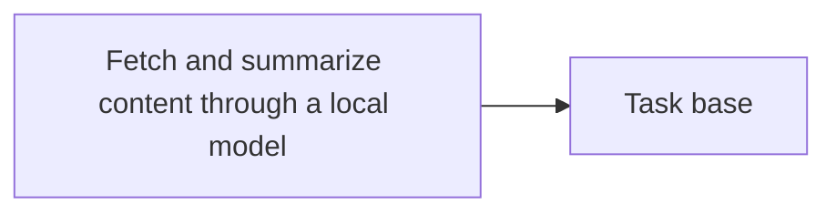

<!-- Generated by docs.api.reference; do not edit. -->
# Fetch and summarize content through a local model

[API index](index.md) | [Definition schema](schema.md)

| Field | Value |
| --- | --- |
| ID | `research.local.summarize.task` |
| Source | `07_tasks/research.local.summarize.task.yaml` |
| Tags | task |

Fetch readable content from a URL or search topic and summarize it
through the local Ollama harness. Returns a markdown-formatted summary
or fallback text if Ollama is unavailable.
Wraps lib.research.local_summarize.local_research_scaffold.


## Relationships

| Relation | Definitions |
| --- | --- |
| Extends | [Task base](task.base.md) |
| Mixins | - |
| Children | - |
| Mixin consumers | - |
| Modules | - |




## Declared API

### Inputs

| Name | Type | Required | Default | Description |
| --- | --- | --- | --- | --- |
| `topic_or_url` | `string` | yes | `-` | A URL (starting with http) or a search topic string. |


### Variables

| Name | YAML Type | Value / Template | Description |
| --- | --- | --- | --- |
| - | - | - | No locally declared variables. |


### Run Operations

#### Python

_No operation description provided._

```python
import json, os
from lib.research.local_summarize import local_research_scaffold

summary = local_research_scaffold("{{ topic_or_url }}")
with open(os.environ["STATE_FILE"], "w") as f:
    json.dump({"summary": summary}, f)

```

### Teardown Operations

_No locally declared teardown operations._

## Resolved API

### Effective Inputs

| Name | Type | Required | Default | Origin |
| --- | --- | --- | --- | --- |
| `topic_or_url` | `string` | yes | `-` | [Fetch and summarize content through a local model](research.local.summarize.task.md) |


### Effective Variables

| Name | Value / Template | Origin |
| --- | --- | --- |
| `system_log_format` | `[{{ entity_id }} \| {{ runtime.version }}]` | [Abstract Base](stdlib.base.md) |


### Effective Lifecycle

| Phase | Operation | Origin |
| --- | --- | --- |
| Run | `python` | [Fetch and summarize content through a local model](research.local.summarize.task.md) |
