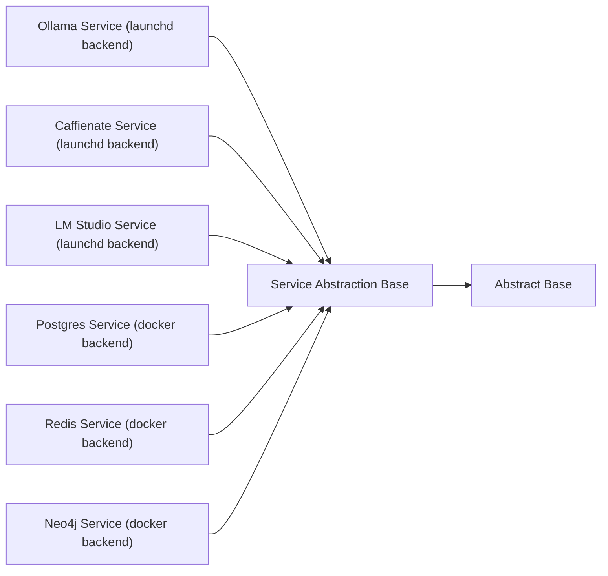

<!-- Generated by docs.api.reference; do not edit. -->
# Service Abstraction Base

[API index](index.md) | [Definition schema](schema.md)

| Field | Value |
| --- | --- |
| ID | `service.base` |
| Source | `02_core/runtimes/yaml/definitions/service.yaml` |
| Tags | service, abstract |

Abstract base for a runtime service. Children declare a `backend`
variable ("docker" | "launchd") and a `target` variable (the
backend-specific definition id this service is backed by — e.g.
"docker.ollama" or "launchd.ollama"). They MUST also extend exactly
one of the action-mixins (service.docker.mixin or
service.launchd.mixin) so that `action_to_def` resolves correctly.

The `action` input picks a verb from
{start, stop, enable, disable, install, uninstall, status}. The base
looks up `action_to_def[action]` to find the lifecycle definition to
invoke and `action_arguments[action]` to find the arguments mapping
to pass through.


## Relationships

| Relation | Definitions |
| --- | --- |
| Extends | [Abstract Base](stdlib.base.md) |
| Mixins | - |
| Children | [Ollama Service (launchd backend)](service.ollama.md), [Caffienate Service (launchd backend)](service.caffienate.md), [LM Studio Service (launchd backend)](service.lm-studio.md), [Postgres Service (docker backend)](service.postgres.md), [Redis Service (docker backend)](service.redis.md), [Neo4j Service (docker backend)](service.neo4j.md) |
| Mixin consumers | - |
| Modules | - |




## Declared API

### Inputs

| Name | Type | Required | Default | Description |
| --- | --- | --- | --- | --- |
| `action` | `string` | yes | `-` | Lifecycle verb: start | stop | enable | disable | install | uninstall | status |


### Variables

| Name | YAML Type | Value / Template | Description |
| --- | --- | --- | --- |
| `backend` | `str` | `` | - |
| `target` | `str` | `` | - |
| `action_to_def` | `dict` | `{}` | - |
| `action_arguments` | `dict` | `{}` | - |


### Run Operations

#### Invoke

_No operation description provided._

```invoke
invoke:
  definition: '{{ action_to_def[action] }}'
  arguments: '{{ action_arguments[action] }}'
```

### Teardown Operations

_No locally declared teardown operations._

## Resolved API

### Effective Inputs

| Name | Type | Required | Default | Origin |
| --- | --- | --- | --- | --- |
| `action` | `string` | yes | `-` | [Service Abstraction Base](service.base.md) |


### Effective Variables

| Name | Value / Template | Origin |
| --- | --- | --- |
| `system_log_format` | `[{{ entity_id }} \| {{ runtime.version }}]` | [Abstract Base](stdlib.base.md) |
| `backend` | `` | [Service Abstraction Base](service.base.md) |
| `target` | `` | [Service Abstraction Base](service.base.md) |
| `action_to_def` | `{}` | [Service Abstraction Base](service.base.md) |
| `action_arguments` | `{}` | [Service Abstraction Base](service.base.md) |


### Effective Lifecycle

| Phase | Operation | Origin |
| --- | --- | --- |
| Run | `invoke` | [Service Abstraction Base](service.base.md) |
