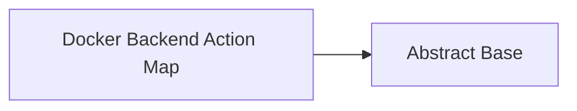

<!-- Generated by docs.api.reference; do not edit. -->
# Docker Backend Action Map

[API index](index.md) | [Definition schema](schema.md)

| Field | Value |
| --- | --- |
| ID | `service.docker.mixin` |
| Source | `02_core/runtimes/yaml/definitions/service.yaml` |
| Tags | service, docker, abstract |

Mixin that wires the docker-backend action verbs to their lifecycle
definitions. `target` (set by the consuming service) is the
`docker.<id>` definition; lifecycle defs take `target_dir` which we
derive as `14_data/<target-flat>/`.

Note: docker has no "enable"/"disable" concept (compose services
are always reachable once their compose file exists), so those verbs
map to no-ops via a `stdlib.logger` invocation that records the no-op.

## Relationships

| Relation | Definitions |
| --- | --- |
| Extends | [Abstract Base](stdlib.base.md) |
| Mixins | - |
| Children | - |
| Mixin consumers | [Postgres Service (docker backend)](service.postgres.md), [Redis Service (docker backend)](service.redis.md), [Neo4j Service (docker backend)](service.neo4j.md) |
| Modules | - |

## Declared API

### Inputs

| Name | Type | Required | Default | Description |
| --- | --- | --- | --- | --- |
| - | - | - | - | No locally declared inputs. |

### Variables

| Name | YAML Type | Value / Template | Description |
| --- | --- | --- | --- |
| `action_to_def` | `dict` | `{'start': 'compose.up', 'stop': 'compose.down', 'status': 'compose.status', 'install': 'compose.up', 'uninstall': 'compose.down', 'enable': 'stdlib.logger', 'disable': 'stdlib.logger'}` | - |
| `action_arguments` | `dict` | `{'start': {'target_dir': "14_data/{{ target \| replace('.', '_') }}"}, 'stop': {'target_dir': "14_data/{{ target \| replace('.', '_') }}"}, 'status': {'target_dir': "14_data/{{ target \| replace('.', '_') }}"}, 'install': {'target_dir': "14_data/{{ target \| replace('.', '_') }}"}, 'uninstall': {'target_dir': "14_data/{{ target \| replace('.', '_') }}"}, 'enable': {'message': 'docker backend: enable is a no-op', 'level': 'INFO'}, 'disable': {'message': 'docker backend: disable is a no-op', 'level': 'INFO'}}` | - |

### Run Operations

_No locally declared run operations._

### Teardown Operations

_No locally declared teardown operations._

## Resolved API

### Effective Inputs

| Name | Type | Required | Default | Origin |
| --- | --- | --- | --- | --- |
| - | - | - | - | No effective inputs. |

### Effective Variables

| Name | Value / Template | Origin |
| --- | --- | --- |
| `system_log_format` | `[{{ entity_id }} \| {{ runtime.version }}]` | [Abstract Base](stdlib.base.md) |
| `action_to_def` | `{'start': 'compose.up', 'stop': 'compose.down', 'status': 'compose.status', 'install': 'compose.up', 'uninstall': 'compose.down', 'enable': 'stdlib.logger', 'disable': 'stdlib.logger'}` | [Docker Backend Action Map](service.docker.mixin.md) |
| `action_arguments` | `{'start': {'target_dir': "14_data/{{ target \| replace('.', '_') }}"}, 'stop': {'target_dir': "14_data/{{ target \| replace('.', '_') }}"}, 'status': {'target_dir': "14_data/{{ target \| replace('.', '_') }}"}, 'install': {'target_dir': "14_data/{{ target \| replace('.', '_') }}"}, 'uninstall': {'target_dir': "14_data/{{ target \| replace('.', '_') }}"}, 'enable': {'message': 'docker backend: enable is a no-op', 'level': 'INFO'}, 'disable': {'message': 'docker backend: disable is a no-op', 'level': 'INFO'}}` | [Docker Backend Action Map](service.docker.mixin.md) |

### Effective Lifecycle

| Phase | Operation | Origin |
| --- | --- | --- |
| Run | `python` | [Abstract Base](stdlib.base.md) |
