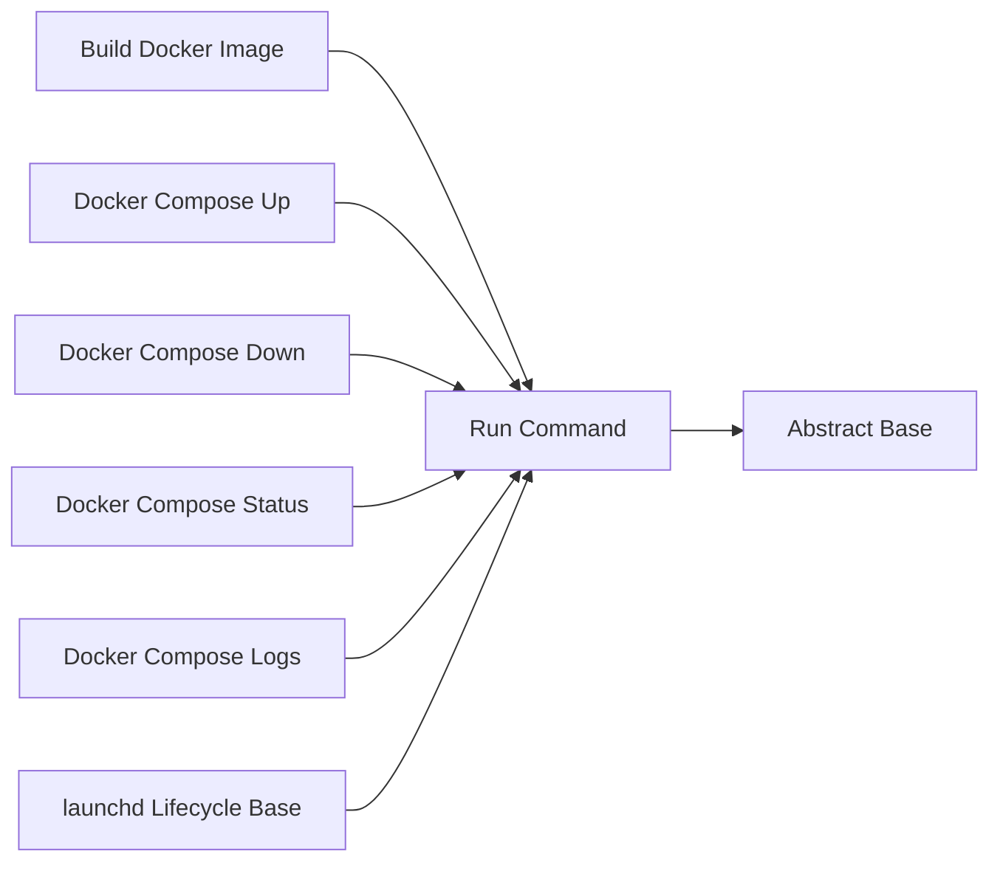

<!-- Generated by docs.api.reference; do not edit. -->
# Run Command

[API index](index.md) | [Definition schema](schema.md)

| Field | Value |
| --- | --- |
| ID | `stdlib.run-command` |
| Source | `02_core/runtimes/yaml/definitions/stdlib.yaml` |
| Tags | shell |

Executes a shell command in a supplied working directory.


## Relationships

| Relation | Definitions |
| --- | --- |
| Extends | [Abstract Base](stdlib.base.md) |
| Mixins | - |
| Children | [Build Docker Image](docker.build.md), [Docker Compose Up](compose.up.md), [Docker Compose Down](compose.down.md), [Docker Compose Status](compose.status.md), [Docker Compose Logs](compose.logs.md), [launchd Lifecycle Base](launchd.lifecycle.base.md) |
| Mixin consumers | - |
| Modules | - |




## Declared API

### Inputs

| Name | Type | Required | Default | Description |
| --- | --- | --- | --- | --- |
| `command` | `string` | no | `` | Shell command to execute. Optional so that children can supply the
command body via a `variables.command:` Jinja template (variables
render after inputs and overwrite this default in scope).
 |
| `working_dir` | `string` | no | `{{ env.cwd }}` | Directory in which to execute the command. |


### Variables

| Name | YAML Type | Value / Template | Description |
| --- | --- | --- | --- |
| - | - | - | No locally declared variables. |


### Run Operations

#### Execute shell command

_No operation description provided._

```bash
cd "{{ working_dir }}"
{{ command }}

```

### Teardown Operations

_No locally declared teardown operations._

## Resolved API

### Effective Inputs

| Name | Type | Required | Default | Origin |
| --- | --- | --- | --- | --- |
| `command` | `string` | no | `` | [Run Command](stdlib.run-command.md) |
| `working_dir` | `string` | no | `{{ env.cwd }}` | [Run Command](stdlib.run-command.md) |


### Effective Variables

| Name | Value / Template | Origin |
| --- | --- | --- |
| `system_log_format` | `[{{ entity_id }} \| {{ runtime.version }}]` | [Abstract Base](stdlib.base.md) |


### Effective Lifecycle

| Phase | Operation | Origin |
| --- | --- | --- |
| Run | `bash` | [Run Command](stdlib.run-command.md) |
