<!-- Generated by docs.api.reference; do not edit. -->
# Task base

[API index](index.md) | [Definition schema](schema.md)

| Field | Value |
| --- | --- |
| ID | `task.base` |
| Source | `02_core/runtimes/yaml/definitions/task.yaml` |
| Tags | task, abstract |

Abstract base for atomic task definitions. A task is a single
pure-ish operation: takes inputs, returns output, no orchestration,
no lifecycle state. Children declare inputs and a `run:` block that
typically wraps a Python function in `lib.*`.

## Relationships

| Relation | Definitions |
| --- | --- |
| Extends | [Abstract Base](stdlib.base.md) |
| Mixins | - |
| Children | [Scan Boundary Violations](audit.boundary_violations.scan.task.md), [Fetch readable text from a URL or search topic](browser.fetch.text.task.md), [Build file classification manifest](classify.manifest.build.task.md), [Return broad media class for a path](classify.media.class_for_path.task.md), [Classify a file by media type and destination](classify.media.file.task.md), [Chunk a file into embeddable text segments](embeddings.chunker.chunk_file.task.md), [Generate an embedding vector for text](embeddings.embed.text.task.md), [Query the local knowledge base](embeddings.query.search.task.md), [Collect indexable files for embedding sweep](embeddings.sweep.collect_files.task.md), [Compute MD5 hash of a file](embeddings.sweep.file_hash.task.md), [Load the embedding sweep manifest](embeddings.sweep.load_manifest.task.md), [Persist the embedding sweep manifest](embeddings.sweep.save_manifest.task.md), [Iterate files in a directory tree](files.iter.task.md), [Compute SHA-256 hash of a file](files.sha256.task.md), [Write data to a JSON file](files.write_json.task.md), [Classify an image by semantic type](image.classify.task.md), [Extract dominant color palette from an image](image.color.dominant.task.md), [Extract image file metadata](image.meta.extract.task.md), [Assess image quality](image.quality.extract.task.md), [Detect content regions in an image](image.regions.extract.task.md), [Extract OCR text from an image](image.text_ocr.extract.task.md), [Infer document type from filename](metadata.doc_type.task.md), [Infer source origin from file path](metadata.source_guess.task.md), [Get PDF page count](pdf.meta.page_count.task.md), [Fetch and summarize content through a local model](research.local.summarize.task.md), [Run local test suite](shell.tests.run.task.md), [Format a markdown file using a local LM Studio model](text.markdown.format.task.md) |
| Mixin consumers | - |
| Modules | - |

```mermaid
flowchart LR
  def_task_base["Task base"]
def_task_base --> def_stdlib_base["Abstract Base"]
def_audit_boundary_violations_scan_task["Scan Boundary Violations"] --> def_task_base
def_browser_fetch_text_task["Fetch readable text from a URL or search topic"] --> def_task_base
def_classify_manifest_build_task["Build file classification manifest"] --> def_task_base
def_classify_media_class_for_path_task["Return broad media class for a path"] --> def_task_base
def_classify_media_file_task["Classify a file by media type and destination"] --> def_task_base
def_embeddings_chunker_chunk_file_task["Chunk a file into embeddable text segments"] --> def_task_base
def_embeddings_embed_text_task["Generate an embedding vector for text"] --> def_task_base
def_embeddings_query_search_task["Query the local knowledge base"] --> def_task_base
def_embeddings_sweep_collect_files_task["Collect indexable files for embedding sweep"] --> def_task_base
def_embeddings_sweep_file_hash_task["Compute MD5 hash of a file"] --> def_task_base
def_embeddings_sweep_load_manifest_task["Load the embedding sweep manifest"] --> def_task_base
def_embeddings_sweep_save_manifest_task["Persist the embedding sweep manifest"] --> def_task_base
def_files_iter_task["Iterate files in a directory tree"] --> def_task_base
def_files_sha256_task["Compute SHA-256 hash of a file"] --> def_task_base
def_files_write_json_task["Write data to a JSON file"] --> def_task_base
def_image_classify_task["Classify an image by semantic type"] --> def_task_base
def_image_color_dominant_task["Extract dominant color palette from an image"] --> def_task_base
def_image_meta_extract_task["Extract image file metadata"] --> def_task_base
def_image_quality_extract_task["Assess image quality"] --> def_task_base
def_image_regions_extract_task["Detect content regions in an image"] --> def_task_base
def_image_text_ocr_extract_task["Extract OCR text from an image"] --> def_task_base
def_metadata_doc_type_task["Infer document type from filename"] --> def_task_base
def_metadata_source_guess_task["Infer source origin from file path"] --> def_task_base
def_pdf_meta_page_count_task["Get PDF page count"] --> def_task_base
def_research_local_summarize_task["Fetch and summarize content through a local model"] --> def_task_base
def_shell_tests_run_task["Run local test suite"] --> def_task_base
def_text_markdown_format_task["Format a markdown file using a local LM Studio model"] --> def_task_base
```

## Declared API

### Inputs

| Name | Type | Required | Default | Description |
| --- | --- | --- | --- | --- |
| - | - | - | - | No locally declared inputs. |

### Variables

| Name | YAML Type | Value / Template | Description |
| --- | --- | --- | --- |
| - | - | - | No locally declared variables. |

### Run Operations

_No locally declared run operations._

### Teardown Operations

_No locally declared teardown operations._

## Resolved API

### Effective Inputs

| Name | Type | Required | Default | Origin |
| --- | --- | --- | --- | --- |
| - | - | - | - | No effective inputs. |

### Effective Variables

| Name | Value / Template | Origin |
| --- | --- | --- |
| `system_log_format` | `[{{ entity_id }} \| {{ runtime.version }}]` | [Abstract Base](stdlib.base.md) |

### Effective Lifecycle

| Phase | Operation | Origin |
| --- | --- | --- |
| Run | `python` | [Abstract Base](stdlib.base.md) |
