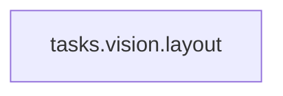

<!-- Generated by docs.api.reference; do not edit. -->
# tasks.vision.layout

[API index](index.md) | [Definition schema](schema.md)

| Field | Value |
| --- | --- |
| ID | `tasks.vision.layout` |
| Source | `<raw>` |
| Tags | - |

_No description provided._

## Relationships

| Relation | Definitions |
| --- | --- |
| Extends | - |
| Mixins | - |
| Children | - |
| Mixin consumers | - |
| Modules | - |

## Declared API

### Inputs

| Name | Type | Required | Default | Description |
| --- | --- | --- | --- | --- |
| - | - | - | - | No locally declared inputs. |

### Variables

| Name | YAML Type | Value / Template | Description |
| --- | --- | --- | --- |
| `body` | `str` | ` Describe only the page structure and spacing. Return exactly this markdown shape: ## Layout - Header: <short description> - Main area: <short description> - Lower area: <short description> - Footer: <short description> Rules: - Maximum 4 bullets. - Do not transcribe any visible text. - Do not list navigation items, headings, or button labels one by one. - Mention only large visible blocks, media, CTA areas, and spacing. - No placeholders except the angle-bracket examples in this template. - End with <END>. ` | - |

### Run Operations

_No locally declared run operations._

### Teardown Operations

_No locally declared teardown operations._

## Resolved API

### Effective Inputs

| Name | Type | Required | Default | Origin |
| --- | --- | --- | --- | --- |
| - | - | - | - | No effective inputs. |

### Effective Variables

| Name | Value / Template | Origin |
| --- | --- | --- |
| `body` | ` Describe only the page structure and spacing. Return exactly this markdown shape: ## Layout - Header: <short description> - Main area: <short description> - Lower area: <short description> - Footer: <short description> Rules: - Maximum 4 bullets. - Do not transcribe any visible text. - Do not list navigation items, headings, or button labels one by one. - Mention only large visible blocks, media, CTA areas, and spacing. - No placeholders except the angle-bracket examples in this template. - End with <END>. ` | [tasks.vision.layout](tasks.vision.layout.md) |

### Effective Lifecycle

| Phase | Operation | Origin |
| --- | --- | --- |
| - | - | No effective lifecycle operations. |
