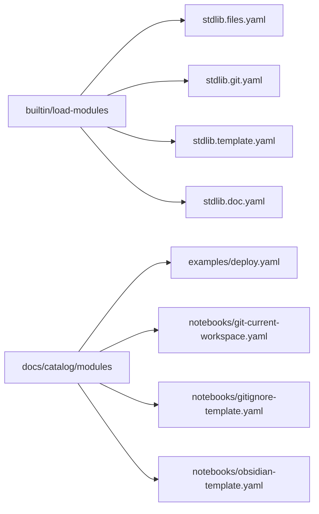

<!-- Generated by workflows.yaml docs/api/reference; do not edit. -->
# YAML API Reference

This reference is generated by the `docs/api/reference` YAML workflow. It describes the
standard library, runnable notebooks, examples, and the documentation workflow itself.

Regenerate or verify committed output from `20_workspaces/06_workflows/yaml/`:

```bash
python interpreter.py api-docs.yaml docs/api/reference --output_dir=docs --mode=write
python interpreter.py api-docs.yaml docs/api/reference --output_dir=docs --mode=check
```

See the [definition authoring schema](schema.md) for metadata and composition fields.

## Definitions

| Definition | ID | Source | Tags |
| --- | --- | --- | --- |
| [Abstract Base](definitions/abstract/base.md) | `abstract/base` | `stdlib/stdlib.yaml` | core, abstract |
| [Load Standard Library Modules](definitions/builtin/load-modules.md) | `builtin/load-modules` | `stdlib/stdlib.yaml` | core, modules |
| [Run Command](definitions/builtin/run-command.md) | `builtin/run-command` | `stdlib/stdlib.yaml` | shell |
| [Clean Workspace](definitions/builtin/clean-workspace.md) | `builtin/clean-workspace` | `stdlib/stdlib.yaml` | files, destructive |
| [Logger](definitions/builtin/logger.md) | `builtin/logger` | `stdlib/stdlib.yaml` | logging |
| [Write Text File](definitions/builtin/files/write-text.md) | `builtin/files/write-text` | `stdlib/stdlib.files.yaml` | files, templates |
| [Create Directory](definitions/builtin/files/create-directory.md) | `builtin/files/create-directory` | `stdlib/stdlib.files.yaml` | files |
| [Initialize Current Git Workspace](definitions/builtin/git/init-current-workspace.md) | `builtin/git/init-current-workspace` | `stdlib/stdlib.git.yaml` | git |
| [Write Python Gitignore](definitions/builtin/git/gitignore-python.md) | `builtin/git/gitignore-python` | `stdlib/stdlib.git.yaml` | git, files, templates |
| [Create GitHub Repository](definitions/builtin/git/create-github-repository.md) | `builtin/git/create-github-repository` | `stdlib/stdlib.git.yaml` | git, github |
| [Render Markdown Template](definitions/builtin/template/render-markdown.md) | `builtin/template/render-markdown` | `stdlib/stdlib.template.yaml` | templates, documentation |
| [Prune Generated Definition Pages](definitions/builtin/docs/prune-definition-pages.md) | `builtin/docs/prune-definition-pages` | `stdlib/stdlib.doc.yaml` | documentation, files |
| [Render API Reference](definitions/builtin/docs/render-reference.md) | `builtin/docs/render-reference` | `stdlib/stdlib.doc.yaml` | documentation, templates |
| [API Documentation Catalog Sources](definitions/docs/catalog/modules.md) | `docs/catalog/modules` | `api-docs.yaml` | documentation, modules |
| [YAML API Reference Build](definitions/docs/api/reference.md) | `docs/api/reference` | `api-docs.yaml` | documentation, workflow |
| [Git Information](definitions/mixin/git-info.md) | `mixin/git-info` | `examples/deploy.yaml` | mixin, git, deployment |
| [Timestamp](definitions/mixin/timestamp.md) | `mixin/timestamp` | `examples/deploy.yaml` | mixin, deployment |
| [Cloud Deployer](definitions/cloud/deployer.md) | `cloud/deployer` | `examples/deploy.yaml` | example, deployment, cloud |
| [Initialize Git Notebook](definitions/notebook/git/init.md) | `notebook/git/init` | `notebooks/git-current-workspace.yaml` | notebook, git |
| [GitHub Repository Notebook](definitions/notebook/git/github.md) | `notebook/git/github` | `notebooks/git-current-workspace.yaml` | notebook, git, github |
| [Gitignore Template Notebook](definitions/notebook/git/gitignore.md) | `notebook/git/gitignore` | `notebooks/gitignore-template.yaml` | notebook, git, templates |
| [Obsidian Daily Note Template](definitions/notebook/obsidian-template.md) | `notebook/obsidian-template` | `notebooks/obsidian-template.yaml` | notebook, obsidian, templates |


## Tags

### abstract

- [Abstract Base](definitions/abstract/base.md) (`abstract/base`)


### cloud

- [Cloud Deployer](definitions/cloud/deployer.md) (`cloud/deployer`)


### core

- [Abstract Base](definitions/abstract/base.md) (`abstract/base`)
- [Load Standard Library Modules](definitions/builtin/load-modules.md) (`builtin/load-modules`)


### deployment

- [Git Information](definitions/mixin/git-info.md) (`mixin/git-info`)
- [Timestamp](definitions/mixin/timestamp.md) (`mixin/timestamp`)
- [Cloud Deployer](definitions/cloud/deployer.md) (`cloud/deployer`)


### destructive

- [Clean Workspace](definitions/builtin/clean-workspace.md) (`builtin/clean-workspace`)


### documentation

- [Render Markdown Template](definitions/builtin/template/render-markdown.md) (`builtin/template/render-markdown`)
- [Prune Generated Definition Pages](definitions/builtin/docs/prune-definition-pages.md) (`builtin/docs/prune-definition-pages`)
- [Render API Reference](definitions/builtin/docs/render-reference.md) (`builtin/docs/render-reference`)
- [API Documentation Catalog Sources](definitions/docs/catalog/modules.md) (`docs/catalog/modules`)
- [YAML API Reference Build](definitions/docs/api/reference.md) (`docs/api/reference`)


### example

- [Cloud Deployer](definitions/cloud/deployer.md) (`cloud/deployer`)


### files

- [Clean Workspace](definitions/builtin/clean-workspace.md) (`builtin/clean-workspace`)
- [Write Text File](definitions/builtin/files/write-text.md) (`builtin/files/write-text`)
- [Create Directory](definitions/builtin/files/create-directory.md) (`builtin/files/create-directory`)
- [Write Python Gitignore](definitions/builtin/git/gitignore-python.md) (`builtin/git/gitignore-python`)
- [Prune Generated Definition Pages](definitions/builtin/docs/prune-definition-pages.md) (`builtin/docs/prune-definition-pages`)


### git

- [Initialize Current Git Workspace](definitions/builtin/git/init-current-workspace.md) (`builtin/git/init-current-workspace`)
- [Write Python Gitignore](definitions/builtin/git/gitignore-python.md) (`builtin/git/gitignore-python`)
- [Create GitHub Repository](definitions/builtin/git/create-github-repository.md) (`builtin/git/create-github-repository`)
- [Git Information](definitions/mixin/git-info.md) (`mixin/git-info`)
- [Initialize Git Notebook](definitions/notebook/git/init.md) (`notebook/git/init`)
- [GitHub Repository Notebook](definitions/notebook/git/github.md) (`notebook/git/github`)
- [Gitignore Template Notebook](definitions/notebook/git/gitignore.md) (`notebook/git/gitignore`)


### github

- [Create GitHub Repository](definitions/builtin/git/create-github-repository.md) (`builtin/git/create-github-repository`)
- [GitHub Repository Notebook](definitions/notebook/git/github.md) (`notebook/git/github`)


### logging

- [Logger](definitions/builtin/logger.md) (`builtin/logger`)


### mixin

- [Git Information](definitions/mixin/git-info.md) (`mixin/git-info`)
- [Timestamp](definitions/mixin/timestamp.md) (`mixin/timestamp`)


### modules

- [Load Standard Library Modules](definitions/builtin/load-modules.md) (`builtin/load-modules`)
- [API Documentation Catalog Sources](definitions/docs/catalog/modules.md) (`docs/catalog/modules`)


### notebook

- [Initialize Git Notebook](definitions/notebook/git/init.md) (`notebook/git/init`)
- [GitHub Repository Notebook](definitions/notebook/git/github.md) (`notebook/git/github`)
- [Gitignore Template Notebook](definitions/notebook/git/gitignore.md) (`notebook/git/gitignore`)
- [Obsidian Daily Note Template](definitions/notebook/obsidian-template.md) (`notebook/obsidian-template`)


### obsidian

- [Obsidian Daily Note Template](definitions/notebook/obsidian-template.md) (`notebook/obsidian-template`)


### shell

- [Run Command](definitions/builtin/run-command.md) (`builtin/run-command`)


### templates

- [Write Text File](definitions/builtin/files/write-text.md) (`builtin/files/write-text`)
- [Write Python Gitignore](definitions/builtin/git/gitignore-python.md) (`builtin/git/gitignore-python`)
- [Render Markdown Template](definitions/builtin/template/render-markdown.md) (`builtin/template/render-markdown`)
- [Render API Reference](definitions/builtin/docs/render-reference.md) (`builtin/docs/render-reference`)
- [Gitignore Template Notebook](definitions/notebook/git/gitignore.md) (`notebook/git/gitignore`)
- [Obsidian Daily Note Template](definitions/notebook/obsidian-template.md) (`notebook/obsidian-template`)


### workflow

- [YAML API Reference Build](definitions/docs/api/reference.md) (`docs/api/reference`)


## Relationship Graph

Solid arrows identify `extends`; dashed arrows identify mixin use.

```mermaid
flowchart TD
def_abstract_base["Abstract Base"]
def_builtin_load_modules["Load Standard Library Modules"]
def_builtin_load_modules --> def_abstract_base
def_builtin_run_command["Run Command"]
def_builtin_run_command --> def_abstract_base
def_builtin_clean_workspace["Clean Workspace"]
def_builtin_clean_workspace --> def_abstract_base
def_builtin_logger["Logger"]
def_builtin_logger --> def_abstract_base
def_builtin_files_write_text["Write Text File"]
def_builtin_files_write_text --> def_abstract_base
def_builtin_files_create_directory["Create Directory"]
def_builtin_files_create_directory --> def_abstract_base
def_builtin_git_init_current_workspace["Initialize Current Git Workspace"]
def_builtin_git_init_current_workspace --> def_abstract_base
def_builtin_git_gitignore_python["Write Python Gitignore"]
def_builtin_git_gitignore_python --> def_builtin_files_write_text
def_builtin_git_create_github_repository["Create GitHub Repository"]
def_builtin_git_create_github_repository --> def_abstract_base
def_builtin_template_render_markdown["Render Markdown Template"]
def_builtin_template_render_markdown --> def_abstract_base
def_builtin_docs_prune_definition_pages["Prune Generated Definition Pages"]
def_builtin_docs_prune_definition_pages --> def_abstract_base
def_builtin_docs_render_reference["Render API Reference"]
def_builtin_docs_render_reference --> def_abstract_base
def_docs_catalog_modules["API Documentation Catalog Sources"]
def_docs_api_reference["YAML API Reference Build"]
def_docs_api_reference --> def_builtin_docs_render_reference
def_mixin_git_info["Git Information"]
def_mixin_timestamp["Timestamp"]
def_cloud_deployer["Cloud Deployer"]
def_cloud_deployer --> def_abstract_base
def_cloud_deployer -.-> def_mixin_timestamp
def_cloud_deployer -.-> def_mixin_git_info
def_notebook_git_init["Initialize Git Notebook"]
def_notebook_git_init -.-> def_builtin_git_init_current_workspace
def_notebook_git_init -.-> def_builtin_git_gitignore_python
def_notebook_git_github["GitHub Repository Notebook"]
def_notebook_git_github -.-> def_builtin_git_init_current_workspace
def_notebook_git_github -.-> def_builtin_git_gitignore_python
def_notebook_git_github -.-> def_builtin_git_create_github_repository
def_notebook_git_gitignore["Gitignore Template Notebook"]
def_notebook_git_gitignore --> def_builtin_git_gitignore_python
def_notebook_obsidian_template["Obsidian Daily Note Template"]
def_notebook_obsidian_template --> def_builtin_files_write_text
```



## Module Imports


