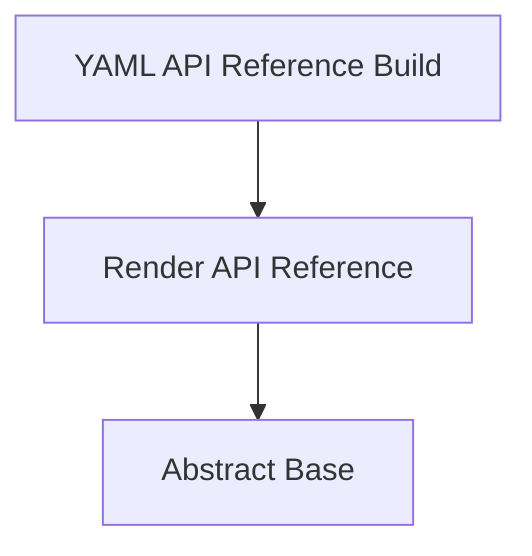

<!-- Generated by workflows.yaml docs/api/reference; do not edit. -->
# Render API Reference

[API index](../../../README.md) | [Definition schema](../../../schema.md)

| Field | Value |
| --- | --- |
| ID | `builtin/docs/render-reference` |
| Source | `stdlib/stdlib.doc.yaml` |
| Tags | documentation, templates |

Generates the catalog index, YAML schema guide, and one page for every imported definition.


## Relationships

| Relation | Definitions |
| --- | --- |
| Extends | [Abstract Base](../../abstract/base.md) |
| Mixins | - |
| Children | [YAML API Reference Build](../../docs/api/reference.md) |
| Mixin consumers | - |
| Modules | - |



## Declared API

### Inputs

| Name | Type | Required | Default | Description |
| --- | --- | --- | --- | --- |
| `output_dir` | `string` | no | `docs` | Documentation output directory. |
| `mode` | `string` | no | `write` | Either `write` to generate output or `check` to verify it. |


### Variables

| Name | YAML Type | Value / Template | Description |
| --- | --- | --- | --- |
| `template_root` | `str` | `{{ env.cwd }}/templates/docs` | Folder containing authored Markdown templates. |


### Run Operations

#### Render API index

_No operation description provided._

```invoke
invoke:
  definition: builtin/template/render-markdown
  arguments:
    source_template: '{{ template_root }}/index.md.j2'
    target_path: '{{ output_dir }}/README.md'
    mode: '{{ mode }}'
```

#### Render schema guide

_No operation description provided._

```invoke
invoke:
  definition: builtin/template/render-markdown
  arguments:
    source_template: '{{ template_root }}/schema.md.j2'
    target_path: '{{ output_dir }}/schema.md'
    mode: '{{ mode }}'
```

#### Render definition pages

_No operation description provided._

```invoke
invoke:
  definition: builtin/template/render-markdown
  arguments:
    source_template: '{{ template_root }}/definition.md.j2'
    target_path: '{{ output_dir }}/{{ definition.page_path }}'
    mode: '{{ mode }}'
for_each:
  items: runtime.catalog.definitions
  as: definition
```

#### Prune stale definition pages

_No operation description provided._

```invoke
invoke:
  definition: builtin/docs/prune-definition-pages
  arguments:
    output_dir: '{{ output_dir }}'
    mode: '{{ mode }}'
```

### Teardown Operations

_No locally declared teardown operations._

## Resolved API

### Effective Inputs

| Name | Type | Required | Default | Origin |
| --- | --- | --- | --- | --- |
| `output_dir` | `string` | no | `docs` | [Render API Reference](render-reference.md) |
| `mode` | `string` | no | `write` | [Render API Reference](render-reference.md) |


### Effective Variables

| Name | Value / Template | Origin |
| --- | --- | --- |
| `system_log_format` | `[{{ entity_id }} \| {{ runtime.version }}]` | [Abstract Base](../../abstract/base.md) |
| `template_root` | `{{ env.cwd }}/templates/docs` | [Render API Reference](render-reference.md) |


### Effective Lifecycle

| Phase | Operation | Origin |
| --- | --- | --- |
| Run | `invoke` | [Render API Reference](render-reference.md) |
| Run | `invoke` | [Render API Reference](render-reference.md) |
| Run | `invoke` | [Render API Reference](render-reference.md) |
| Run | `invoke` | [Render API Reference](render-reference.md) |
