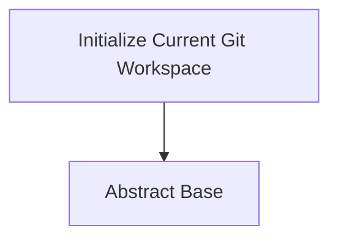

<!-- Generated by workflows.yaml docs/api/reference; do not edit. -->
# Initialize Current Git Workspace

[API index](../../../README.md) | [Definition schema](../../../schema.md)

| Field | Value |
| --- | --- |
| ID | `builtin/git/init-current-workspace` |
| Source | `stdlib/stdlib.git.yaml` |
| Tags | git |

Initializes the current working directory as a Git repository when needed.


## Relationships

| Relation | Definitions |
| --- | --- |
| Extends | [Abstract Base](../../abstract/base.md) |
| Mixins | - |
| Children | - |
| Mixin consumers | [Initialize Git Notebook](../../notebook/git/init.md), [GitHub Repository Notebook](../../notebook/git/github.md) |
| Modules | - |



## Declared API

### Inputs

| Name | Type | Required | Default | Description |
| --- | --- | --- | --- | --- |
| - | - | - | - | No locally declared inputs. |


### Variables

| Name | YAML Type | Value / Template | Description |
| --- | --- | --- | --- |
| `repository_path` | `str` | `{{ env.cwd }}` | Directory to initialize. |
| `initial_branch` | `str` | `main` | Initial branch name for a new repository. |


### Run Operations

#### Initialize repository

_No operation description provided._

```bash
if git -C "{{ repository_path }}" rev-parse --git-dir >/dev/null 2>&1; then
  echo "Git repository already exists at {{ repository_path }}"
else
  git -C "{{ repository_path }}" init -b "{{ initial_branch }}"
fi

```

### Teardown Operations

_No locally declared teardown operations._

## Resolved API

### Effective Inputs

| Name | Type | Required | Default | Origin |
| --- | --- | --- | --- | --- |
| - | - | - | - | No effective inputs. |


### Effective Variables

| Name | Value / Template | Origin |
| --- | --- | --- |
| `system_log_format` | `[{{ entity_id }} \| {{ runtime.version }}]` | [Abstract Base](../../abstract/base.md) |
| `repository_path` | `{{ env.cwd }}` | [Initialize Current Git Workspace](init-current-workspace.md) |
| `initial_branch` | `main` | [Initialize Current Git Workspace](init-current-workspace.md) |


### Effective Lifecycle

| Phase | Operation | Origin |
| --- | --- | --- |
| Run | `bash` | [Initialize Current Git Workspace](init-current-workspace.md) |
