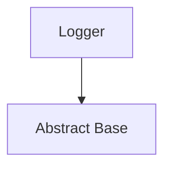

<!-- Generated by workflows.yaml docs/api/reference; do not edit. -->
# Logger

[API index](../../README.md) | [Definition schema](../../schema.md)

| Field | Value |
| --- | --- |
| ID | `builtin/logger` |
| Source | `stdlib/stdlib.yaml` |
| Tags | logging |

Prints a timestamped log message.


## Relationships

| Relation | Definitions |
| --- | --- |
| Extends | [Abstract Base](../abstract/base.md) |
| Mixins | - |
| Children | - |
| Mixin consumers | - |
| Modules | - |



## Declared API

### Inputs

| Name | Type | Required | Default | Description |
| --- | --- | --- | --- | --- |
| `message` | `string` | yes | `-` | Message to log. |
| `level` | `string` | no | `INFO` | Severity label shown with the message. |


### Variables

| Name | YAML Type | Value / Template | Description |
| --- | --- | --- | --- |
| - | - | - | No locally declared variables. |


### Run Operations

#### Print timestamped message

_No operation description provided._

```python
from datetime import datetime
ts = datetime.utcnow().isoformat()
print(f"[{ts}] [{{ level }}] {{ message }}")

```

### Teardown Operations

_No locally declared teardown operations._

## Resolved API

### Effective Inputs

| Name | Type | Required | Default | Origin |
| --- | --- | --- | --- | --- |
| `message` | `string` | yes | `-` | [Logger](logger.md) |
| `level` | `string` | no | `INFO` | [Logger](logger.md) |


### Effective Variables

| Name | Value / Template | Origin |
| --- | --- | --- |
| `system_log_format` | `[{{ entity_id }} \| {{ runtime.version }}]` | [Abstract Base](../abstract/base.md) |


### Effective Lifecycle

| Phase | Operation | Origin |
| --- | --- | --- |
| Run | `python` | [Logger](logger.md) |
