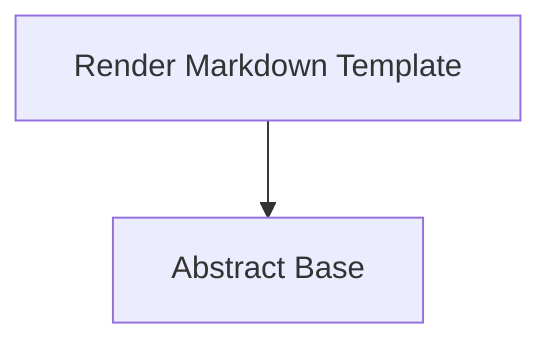

<!-- Generated by workflows.yaml docs/api/reference; do not edit. -->
# Render Markdown Template

[API index](../../../README.md) | [Definition schema](../../../schema.md)

| Field | Value |
| --- | --- |
| ID | `builtin/template/render-markdown` |
| Source | `stdlib/stdlib.template.yaml` |
| Tags | templates, documentation |

Renders an authored Jinja Markdown template to a generated documentation target.


## Relationships

| Relation | Definitions |
| --- | --- |
| Extends | [Abstract Base](../../abstract/base.md) |
| Mixins | - |
| Children | - |
| Mixin consumers | - |
| Modules | - |



## Declared API

### Inputs

| Name | Type | Required | Default | Description |
| --- | --- | --- | --- | --- |
| `source_template` | `string` | yes | `-` | Path to the authored Markdown/Jinja template. |
| `target_path` | `string` | yes | `-` | Path to the generated Markdown file. |
| `mode` | `string` | no | `write` | Either `write` to render or `check` to verify committed output. |


### Variables

| Name | YAML Type | Value / Template | Description |
| --- | --- | --- | --- |
| - | - | - | No locally declared variables. |


### Run Operations

#### Render template asset

Uses the native template operation so Markdown rendering remains deterministic.


```template
template:
  source_path: '{{ source_template }}'
  target_path: '{{ target_path }}'
  mode: '{{ mode }}'
```

### Teardown Operations

_No locally declared teardown operations._

## Resolved API

### Effective Inputs

| Name | Type | Required | Default | Origin |
| --- | --- | --- | --- | --- |
| `source_template` | `string` | yes | `-` | [Render Markdown Template](render-markdown.md) |
| `target_path` | `string` | yes | `-` | [Render Markdown Template](render-markdown.md) |
| `mode` | `string` | no | `write` | [Render Markdown Template](render-markdown.md) |


### Effective Variables

| Name | Value / Template | Origin |
| --- | --- | --- |
| `system_log_format` | `[{{ entity_id }} \| {{ runtime.version }}]` | [Abstract Base](../../abstract/base.md) |


### Effective Lifecycle

| Phase | Operation | Origin |
| --- | --- | --- |
| Run | `template` | [Render Markdown Template](render-markdown.md) |
