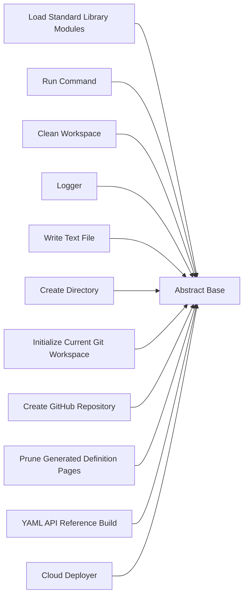

<!-- Generated by workflows.yaml docs/api/reference; do not edit. -->
# Abstract Base

[API index](../README.md) | [Definition schema](../schema.md)

| Field | Value |
| --- | --- |
| ID | `abstract/base` |
| Source | `stdlib/stdlib.yaml` |
| Tags | core, abstract |

Base execution frame shared by standard-library definitions.


## Relationships

| Relation | Definitions |
| --- | --- |
| Extends | - |
| Mixins | - |
| Children | [Load Standard Library Modules](definition-builtin-load-modules.md), [Run Command](definition-builtin-run-command.md), [Clean Workspace](definition-builtin-clean-workspace.md), [Logger](definition-builtin-logger.md), [Write Text File](definition-builtin-files-write-text.md), [Create Directory](definition-builtin-files-create-directory.md), [Initialize Current Git Workspace](definition-builtin-git-init-current-workspace.md), [Create GitHub Repository](definition-builtin-git-create-github-repository.md), [Prune Generated Definition Pages](definition-builtin-docs-prune-definition-pages.md), [YAML API Reference Build](definition-docs-api-reference.md), [Cloud Deployer](definition-cloud-deployer.md) |
| Mixin consumers | - |
| Modules | - |




## Declared API

### Inputs

| Name | Type | Required | Default | Description |
| --- | --- | --- | --- | --- |
| - | - | - | - | No locally declared inputs. |


### Variables

| Name | YAML Type | Value / Template | Description |
| --- | --- | --- | --- |
| `system_log_format` | `str` | `[{{ entity_id }} \| {{ runtime.version }}]` | Standard execution log prefix. |


### Run Operations

#### Announce frame startup

_No operation description provided._

```python
import sys
print(f"Booting execution frame cascade...")

```

### Teardown Operations

_No locally declared teardown operations._

## Resolved API

### Effective Inputs

| Name | Type | Required | Default | Origin |
| --- | --- | --- | --- | --- |
| - | - | - | - | No effective inputs. |


### Effective Variables

| Name | Value / Template | Origin |
| --- | --- | --- |
| `system_log_format` | `[{{ entity_id }} \| {{ runtime.version }}]` | [Abstract Base](definition-abstract-base.md) |


### Effective Lifecycle

| Phase | Operation | Origin |
| --- | --- | --- |
| Run | `python` | [Abstract Base](definition-abstract-base.md) |
