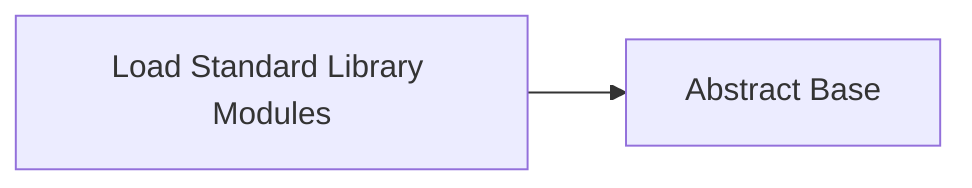

<!-- Generated by workflows.yaml docs/api/reference; do not edit. -->
# Load Standard Library Modules

[API index](../README.md) | [Definition schema](../schema.md)

| Field | Value |
| --- | --- |
| ID | `builtin/load-modules` |
| Source | `stdlib/stdlib.yaml` |
| Tags | core, modules |

Declares the namespaced standard-library modules included in every interpreter run.

## Relationships

| Relation | Definitions |
| --- | --- |
| Extends | [Abstract Base](definition-abstract-base.md) |
| Mixins | - |
| Children | - |
| Mixin consumers | - |
| Modules | `stdlib.files.yaml`, `stdlib.git.yaml`, `stdlib.doc.yaml` |

## Declared API

### Inputs

| Name | Type | Required | Default | Description |
| --- | --- | --- | --- | --- |
| - | - | - | - | No locally declared inputs. |

### Variables

| Name | YAML Type | Value / Template | Description |
| --- | --- | --- | --- |
| `module_namespace` | `str` | `builtin` | - |

### Run Operations

_No locally declared run operations._

### Teardown Operations

_No locally declared teardown operations._

## Resolved API

### Effective Inputs

| Name | Type | Required | Default | Origin |
| --- | --- | --- | --- | --- |
| - | - | - | - | No effective inputs. |

### Effective Variables

| Name | Value / Template | Origin |
| --- | --- | --- |
| `system_log_format` | `[{{ entity_id }} \| {{ runtime.version }}]` | [Abstract Base](definition-abstract-base.md) |
| `module_namespace` | `builtin` | [Load Standard Library Modules](definition-builtin-load-modules.md) |

### Effective Lifecycle

| Phase | Operation | Origin |
| --- | --- | --- |
| Run | `python` | [Abstract Base](definition-abstract-base.md) |
