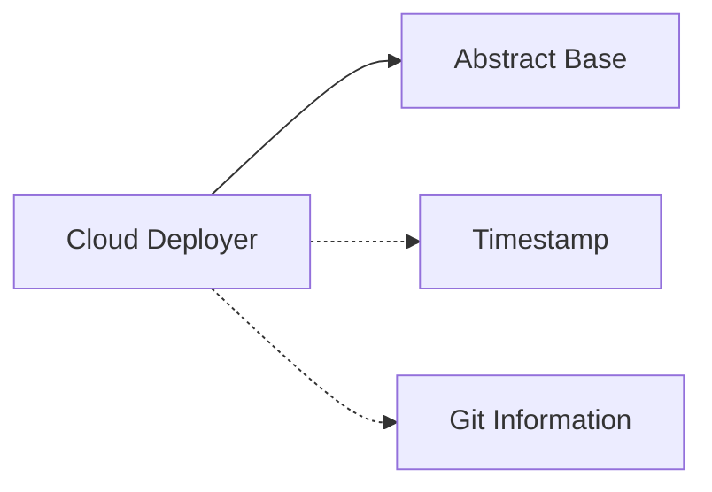

<!-- Generated by workflows.yaml docs/api/reference; do not edit. -->
# Cloud Deployer

[API index](../README.md) | [Definition schema](../schema.md)

| Field | Value |
| --- | --- |
| ID | `cloud/deployer` |
| Source | `examples/deploy.yaml` |
| Tags | example, deployment, cloud |

Demonstrates an inherited, mixin-composed deployment workflow.


## Relationships

| Relation | Definitions |
| --- | --- |
| Extends | [Abstract Base](definition-abstract-base.md) |
| Mixins | [Timestamp](definition-mixin-timestamp.md), [Git Information](definition-mixin-git-info.md) |
| Children | - |
| Mixin consumers | - |
| Modules | - |




## Declared API

### Inputs

| Name | Type | Required | Default | Description |
| --- | --- | --- | --- | --- |
| `service` | `string` | yes | `-` | Name of the service to deploy. |
| `replicas` | `number` | no | `3` | Number of application replicas to deploy. |
| `canary` | `boolean` | no | `false` | Whether to run a canary deployment. |
| `regions` | `array` | no | `us-east-1,us-west-2` | Comma-separated deployment regions. |


### Variables

| Name | YAML Type | Value / Template | Description |
| --- | --- | --- | --- |
| `workspace` | `str` | `{{ env.cwd }}` | Directory from which the deployment workflow executes. |
| `banner` | `str` | `[deploy v{{ runtime.version }}] {{ service }} -> {{ regions }}` | Rendered deployment summary header. |


### Run Operations

#### Display deployment plan

_No operation description provided._

```bash
echo "=========================================="
echo "{{ banner }}"
echo "workspace: {{ workspace }}"
echo "replicas:  {{ replicas }}"
echo "canary:    {{ canary }}"
echo "started:   {{ deploy_started_at }}"
echo "git sha:   {{ git_short_sha }}"
echo "=========================================="

```

#### Write deployment result

_No operation description provided._

```python
import json, os
service = "{{ service }}"
replicas = int("{{ replicas }}")
plan = {
    "deployed_service": service,
    "deployed_replicas": replicas,
    "status": "ok",
}
with open(os.environ["STATE_FILE"], "w") as fh:
    json.dump(plan, fh)
print(json.dumps(plan))

```

### Teardown Operations

#### Report teardown

_No operation description provided._

```bash
echo "tearing down deploy frame for {{ service }}"

```

## Resolved API

### Effective Inputs

| Name | Type | Required | Default | Origin |
| --- | --- | --- | --- | --- |
| `service` | `string` | yes | `-` | [Cloud Deployer](definition-cloud-deployer.md) |
| `replicas` | `number` | no | `3` | [Cloud Deployer](definition-cloud-deployer.md) |
| `canary` | `boolean` | no | `false` | [Cloud Deployer](definition-cloud-deployer.md) |
| `regions` | `array` | no | `us-east-1,us-west-2` | [Cloud Deployer](definition-cloud-deployer.md) |


### Effective Variables

| Name | Value / Template | Origin |
| --- | --- | --- |
| `system_log_format` | `[{{ entity_id }} \| {{ runtime.version }}]` | [Abstract Base](definition-abstract-base.md) |
| `deploy_started_at` | `pending` | [Timestamp](definition-mixin-timestamp.md) |
| `git_short_sha` | `unknown` | [Git Information](definition-mixin-git-info.md) |
| `workspace` | `{{ env.cwd }}` | [Cloud Deployer](definition-cloud-deployer.md) |
| `banner` | `[deploy v{{ runtime.version }}] {{ service }} -> {{ regions }}` | [Cloud Deployer](definition-cloud-deployer.md) |


### Effective Lifecycle

| Phase | Operation | Origin |
| --- | --- | --- |
| Run | `bash` | [Cloud Deployer](definition-cloud-deployer.md) |
| Run | `python` | [Cloud Deployer](definition-cloud-deployer.md) |
| Teardown | `bash` | [Cloud Deployer](definition-cloud-deployer.md) |
