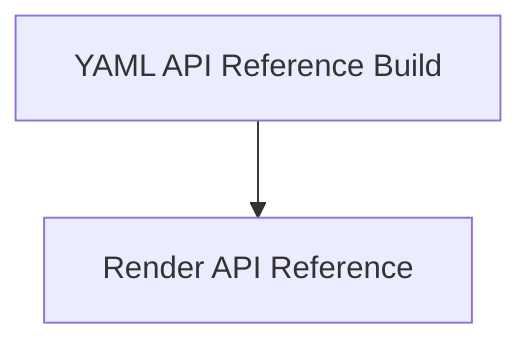

<!-- Generated by workflows.yaml docs/api/reference; do not edit. -->
# YAML API Reference Build

[API index](../../../README.md) | [Definition schema](../../../schema.md)

| Field | Value |
| --- | --- |
| ID | `docs/api/reference` |
| Source | `api-docs.yaml` |
| Tags | documentation, workflow |

Public documentation workflow that renders the complete imported definition catalog.

## Relationships

| Relation | Definitions |
| --- | --- |
| Extends | [Render API Reference](../../builtin/docs/render-reference.md) |
| Mixins | - |
| Children | - |
| Mixin consumers | - |
| Modules | - |

## Declared API

### Inputs

| Name | Type | Required | Default | Description |
| --- | --- | --- | --- | --- |
| - | - | - | - | No locally declared inputs. |

### Variables

| Name | YAML Type | Value / Template | Description |
| --- | --- | --- | --- |
| - | - | - | No locally declared variables. |

### Run Operations

_No locally declared run operations._

### Teardown Operations

_No locally declared teardown operations._

## Resolved API

### Effective Inputs

| Name | Type | Required | Default | Origin |
| --- | --- | --- | --- | --- |
| `output_dir` | `string` | no | `docs` | [Render API Reference](../../builtin/docs/render-reference.md) |
| `mode` | `string` | no | `write` | [Render API Reference](../../builtin/docs/render-reference.md) |

### Effective Variables

| Name | Value / Template | Origin |
| --- | --- | --- |
| `system_log_format` | `[{{ entity_id }} \| {{ runtime.version }}]` | [Abstract Base](../../abstract/base.md) |
| `template_root` | `{{ env.cwd }}/templates/docs` | [Render API Reference](../../builtin/docs/render-reference.md) |

### Effective Lifecycle

| Phase | Operation | Origin |
| --- | --- | --- |
| Run | `invoke` | [Render API Reference](../../builtin/docs/render-reference.md) |
| Run | `invoke` | [Render API Reference](../../builtin/docs/render-reference.md) |
| Run | `invoke` | [Render API Reference](../../builtin/docs/render-reference.md) |
| Run | `invoke` | [Render API Reference](../../builtin/docs/render-reference.md) |
