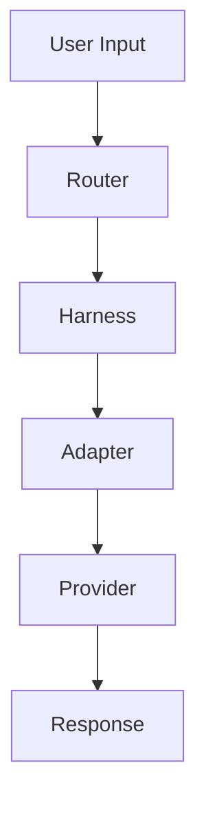
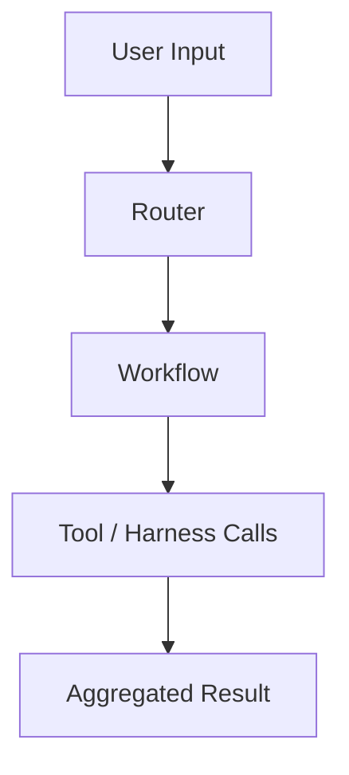
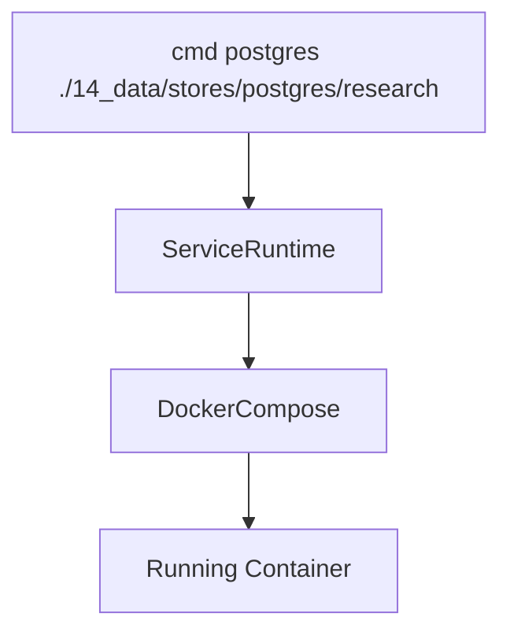
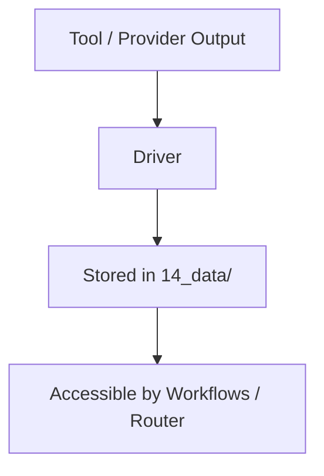

# Architecture

## Purpose

Defines the system architecture, core abstractions, execution model, and interaction flow for the repository.

This system is designed to provide a unified, provider-agnostic orchestration layer over LLMs, tools, and services, supporting both local-first and hybrid execution.

## System Overview

The architecture is composed of modular layers:

```mermaid
flowchart TD
    Interfaces["User / CLI / MCP"] --> Router
    Router --> Workflows[Workflows (optional)]
    Workflows --> Harness[Harness Layer]
    Harness --> Adapter[Adapter Layer]
    Adapter --> Provider["Provider / Service / Tool"]
    Provider --> Drivers
    Drivers --> DataLayer[Data Layer]
```

## Core Layers

### 1. Interfaces

Entry points into the system.

| Interface | Description                 |
| --------- | --------------------------- |
| CLI       | Local command execution     |
| MCP       | Tool/resource exposure      |
| API       | OpenAI-compatible / REST    |
| Scripts   | Shell or Python entrypoints |

### 2. Router

Responsible for selecting the execution path.

**Inputs:**

- Task type
- Context size
- Cost constraints
- Latency requirements
- Capability requirements

**Outputs:**

- Selected harness
- Optional workflow
- Execution strategy

---

### 3. Workflows

Optional orchestration layer using LangGraph or LangChain.

**Responsibilities:**

- Multi-step execution
- Tool chaining
- Iterative reasoning
- Structured outputs

---

### 4. Harness Layer

Manages execution lifecycle.

**Responsibilities:**

- Process or API invocation
- Streaming responses
- Retry and timeout handling
- Authentication
- Logging and telemetry

Each provider/tool has its own harness.

### 5. Adapter Layer

Translates external interfaces into internal contracts.

**Examples:**

- CLI to structured request
- OpenAI API to normalized schema
- REST to internal format

Adapters are thin and stateless.

---

### 6. Providers, Services, and Tools

Execution targets.

| Type          | Examples                      |
| ------------- | ----------------------------- |
| LLM Providers | Claude, Codex, Gemini, OpenAI |
| Local Models  | Ollama, LM Studio             |
| Services      | Postgres, Qdrant, OpenSearch  |
| Tools         | PDF parser, OCR, embedding    |

---

### 7. Drivers

Provide access to storage systems.

**Responsibilities:**

- Read/write/query data
- Normalize backend differences
- Initialize storage if needed

---

### 8. Data Layer

Filesystem-backed persistent storage.

**Characteristics:**

- Path-addressable
- Portable
- Deterministic

All data resides under:

`14_data/`

---

## Core Abstractions

### Adapter

- Translates interface → internal schema
- Stateless
- No lifecycle management

---

### Harness

- Controls execution lifecycle
- Handles retries, streaming, logging
- Wraps adapters and providers

---

### Driver

- Provides access to storage
- Abstracts database and file systems

---

### Service

- Docker-based executable unit
- Stateless definition + stateful data

---

### Service Runtime

- Executes services via CLI abstraction
- Maps a service to its data path

---

### Workflow

- Multi-step execution graph
- Uses harnesses and tools

---

### Router

- Decision engine
- Selects optimal execution path

---

## Execution Flow

### Simple Request



---

### Workflow Execution



---

### Service Invocation



---

### Data Flow



---

## Contract System

All components communicate via shared contracts:

- Request schema
- Response schema
- Streaming event schema
- Tool invocation schema

Located in:

`01_contracts/`

---

## Repo Organization

All code is organized by classification at the repo root:

```text
.
├── 01_contracts/
├── 02_core/
├── 03_adapters/
├── 04_harnesses/
├── 05_router/
├── 06_workflows/
├── 07_tools/
├── 08_drivers/
├── 09_services/
├── 10_service_runtime/
├── 11_mcp/
├── 12_prompts/
├── 13_models/
├── 14_data/
```

---

## Design Principles

### 1. Flat Classification

- Organize by responsibility, not project
- Avoid deep nesting

---

### 2. Separation of Concerns

- Adapters do not manage execution
- Harnesses do not implement storage
- Drivers do not contain business logic

---

### 3. Provider Agnostic

- Unified interface across all providers
- Interchangeable execution targets

---

### 4. Local-First

- Prefer local models and storage
- Use remote providers when needed

---

### 5. Services as Tools

- Treat Docker services as executable units
- Use filesystem as the source of truth

---

### 6. Deterministic Execution

- Path-based addressing
- Reproducible workflows

---

### 7. Extensibility

- New providers via harness + adapter
- New storage via drivers
- New workflows via LangGraph

---

## Interaction Surfaces

| Surface     | Role                   |
| ----------- | ---------------------- |
| CLI (`cmd`) | Service execution      |
| MCP         | Tool exposure          |
| Router API  | Internal orchestration |
| Workflows   | Multi-step logic       |
| Drivers     | Data access            |

---

## Capability Matrix

The system supports:

| Capability            | Layer                |
| --------------------- | -------------------- |
| Multi-model routing   | Router               |
| Tool execution        | Workflows / Harness  |
| Storage abstraction   | Drivers              |
| Service orchestration | Service Runtime      |
| Streaming responses   | Harness              |
| Local + cloud models  | Adapters / Harnesses |


## Future Architecture Extensions

- Distributed execution across nodes
- Multi-agent coordination layer
- Automatic tool generation
- Dynamic workflow synthesis
- Dataset versioning and lineage tracking
- Remote execution backends (Kubernetes)

---

## Summary

This architecture provides:

- A unified execution model across tools, models, and services
- Clear separation between interface, execution, and storage
- A scalable foundation for building agentic and automated systems
- A local-first, portable, and reproducible environment

---
