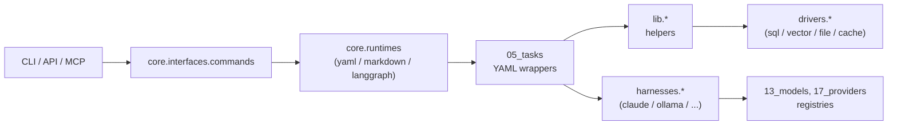

# LocalFabric

<!-- PROJECT_TAGLINE_START -->

**Local-first AI orchestration for models, tools, workflows, and data services.**

<!-- PROJECT_TAGLINE_END -->

LocalFabric is a modular platform for building private, reproducible AI workflows that run on local infrastructure first and can extend to cloud providers when needed. It binds model routing, reusable tasks, YAML / markdown / LangGraph runtimes, service orchestration, storage drivers, prompt assets, and responsibility auditing into a single workspace.

## Why LocalFabric

AI work accumulates provider-specific integrations, scratch scripts, and operational state that nobody can reproduce. LocalFabric gives that work a structure:

- Route requests across local and cloud model providers behind one set of harnesses.
- Compose multi-step image, document, retrieval, and research workflows from reusable atomic tasks.
- Run services (LLM runtimes, vector stores, databases) from a Docker-Compose catalog grouped by category.
- Persist state in filesystem-backed roots that any environment can mount.
- Audit responsibility boundaries automatically so the architecture doesn't drift as code lands.

## Architecture At A Glance



## Repository Layout

Implementation lives directly under the repo root in numeric-prefixed responsibility buckets. Each bucket owns a single concern.

<!-- BUCKETS_TABLE_START -->

| Bucket                             | Role                                                                                               | Import name  |
| ---------------------------------- | -------------------------------------------------------------------------------------------------- | ------------ |
| [`00_specs/`](00_specs/)           | Agent-ready specs and task artifacts                                                               | —            |
| [`01_interfaces/`](01_interfaces/) | Python Protocol mirrors of the JSON schemas                                                        | `interfaces` |
| [`02_core/`](02_core/)             | Core libraries — environment, router, runtimes (yaml/markdown/langgraph), interfaces (cli/api/mcp) | `core`       |
| [`03_schemas/`](03_schemas/)       | Shared JSON schemas used across components                                                         | —            |
| [`04_harnesses/`](04_harnesses/)   | Provider harnesses — execution lifecycle per model provider                                        | `harnesses`  |
| [`05_tasks/`](05_tasks/)           | YAML task wrappers — one .task.yaml file per atomic lib.\* function                                | —            |
| [`06_workflows/`](06_workflows/)   | Composed pipelines of tasks (YAML)                                                                 | —            |
| [`07_lib/`](07_lib/)               | Python helper library invoked by YAML tasks (image, pdf, embeddings, classify, research, …)        | `lib`        |
| [`08_drivers/`](08_drivers/)       | Storage/database connectors                                                                        | `drivers`    |
| [`09_docker/`](09_docker/)         | Docker service definitions (extend docker.base)                                                    | —            |
| [`10_launchd/`](10_launchd/)       | macOS launchd job definitions (extend launchd.base)                                                | —            |
| [`11_services/`](11_services/)     | Docker-Compose service catalog by category                                                         | —            |
| [`12_prompts/`](12_prompts/)       | Prompt templates (markdown runtime sources)                                                        | —            |
| [`13_models/`](13_models/)         | Per-model YAML registry (one file per model; declares providers and features)                      | —            |
| [`14_data/`](14_data/)             | Persistent data (filesystem-backed)                                                                | —            |
| [`15_examples/`](15_examples/)     | Example YAML definitions showing runtime composition patterns                                      | —            |
| [`16_tests/`](16_tests/)           | Integration and contract tests                                                                     | —            |
| [`17_providers/`](17_providers/)   | Per-provider YAML registry (one file per provider; declares protocols and endpoints)               | —            |
| [`18_docs/`](18_docs/)             | Supporting docs                                                                                    | —            |
| [`19_templates/`](19_templates/)   | Document templates rendered by YAML workflows                                                      | —            |
| [`20_notebooks/`](20_notebooks/)   | Exploration notebooks                                                                              | —            |

<!-- BUCKETS_TABLE_END -->

## Python Aliases

Numeric prefixes are filesystem-only — Python forbids module names that start with a digit. `[tool.setuptools.package-dir]` in [`pyproject.toml`](pyproject.toml) registers a clean alias for every importable bucket (`uv sync` writes a `.pth` shim into the project venv), and [`conftest.py`](conftest.py) re-registers the same aliases at pytest startup so the suite runs without an install. Always import via the alias (`from drivers.sql.session import init_db`), never via the numeric path.

<!-- PYTHON_ALIASES_START -->

### `interfaces` — [`01_interfaces/`](01_interfaces/)

_Top-level package only._

### `core` — [`02_core/`](02_core/)

- `core.environment`
- `core.interfaces` — `api`, `cli`, `commands`, `mcp`
- `core.router`
- `core.runtimes` — `langgraph`, `markdown`, `yaml`

### `harnesses` — [`04_harnesses/`](04_harnesses/)

- `harnesses.claude`
- `harnesses.codex`
- `harnesses.gemini`
- `harnesses.lmstudio`
- `harnesses.ollama`
- `harnesses.openai`

### `lib` — [`07_lib/`](07_lib/)

- `lib.audit`
- `lib.browser`
- `lib.classify`
- `lib.embeddings`
- `lib.image`
- `lib.metadata`
- `lib.pdf`
- `lib.research`
- `lib.shell`
- `lib.text`

### `drivers` — [`08_drivers/`](08_drivers/)

- `drivers.cache`
- `drivers.file`
- `drivers.sql`
- `drivers.vector`

<!-- PYTHON_ALIASES_END -->

## Console Scripts

<!-- CLI_COMMANDS_START -->

| Command           | Entry point                                 |
| ----------------- | ------------------------------------------- |
| `localfabric`     | `core.interfaces.cli.main:app`              |
| `localfabric-api` | `core.interfaces.api.app:cli_main`          |
| `localfabric-mcp` | `core.interfaces.mcp.server:main`           |
| `localfabric-md`  | `core.interfaces.cli.markdown_runtime:main` |

<!-- CLI_COMMANDS_END -->

## Optional Dependency Groups

Install with `uv sync --extra <group>`; combine groups by repeating `--extra`.

<!-- OPTIONAL_GROUPS_START -->

| Group      | Packages                                                                                                                                                                                  |
| ---------- | ----------------------------------------------------------------------------------------------------------------------------------------------------------------------------------------- |
| `dev`      | `pytest>=8.0`, `ruff>=0.4`, `mypy>=1.10`, `mdformat>=0.7`, `mdformat-gfm>=0.3`, `mdformat-frontmatter>=2.0`, `mdformat-tables>=1.0`, `yamlfix>=1.16`, `yamllint>=1.35`, `pre-commit>=3.7` |
| `llm`      | `anthropic>=0.40`, `openai>=1.0`, `google-generativeai>=0.5`                                                                                                                              |
| `notebook` | `ipykernel>=6.0`                                                                                                                                                                          |
| `pdf`      | `pymupdf>=1.24`, `pdfminer.six>=20221105`, `pdf2image>=1.16`                                                                                                                              |
| `vector`   | `lancedb>=0.6`                                                                                                                                                                            |
| `vision`   | `opencv-python>=4.8`, `pytesseract>=0.3`                                                                                                                                                  |

<!-- OPTIONAL_GROUPS_END -->

## Getting Started

[uv](https://docs.astral.sh/uv/) is the primary Python interface for this repo — don't use bare `pip` / `python` to operate the project. See [AGENTS.md](AGENTS.md) for the full convention.

```bash
uv sync --extra dev  # install base + dev extras
uv sync --extra llm  # add Claude / OpenAI / LM Studio providers
uv run pytest  # run the test suite
uv run localfabric --help  # primary CLI
uv run localfabric-md --help  # markdown runtime
uv run localfabric-mcp  # expose tools over MCP
uv run localfabric-api  # serve the FastAPI surface
```

Run a YAML workflow directly:

```bash
uv run python 02_core/runtimes/yaml/interpreter.py \
    06_workflows/docs.readme.generate.workflow.yaml docs.readme.generate.workflow
```

Bring up a service from the Docker-Compose catalog:

```bash
docker compose -f 11_services/<category>/<service>/docker-compose.yml up -d
```

## Notes For Contributors

- **uv is the primary Python interface.** Treat `pip` / bare `python` in older docs as legacy and update them. See [AGENTS.md](AGENTS.md).
- Cross-bucket imports use the clean alias (`from drivers.sql.session import init_db`), never the numeric path.
- [`core.environment.REPO_ROOT`](02_core/environment/paths.py) is the canonical anchor for path resolution — no `os.path.join(__file__, "..", "..")` patterns anywhere else.
- Regenerate this README with `make docs`; the classification-boundary audit runs via `make audit` and writes findings to `14_data/runs/classification_audit/`.

## Design Principles

- **Local-first, hybrid-ready:** prefer private local execution while allowing cloud provider integrations.
- **Provider-agnostic orchestration:** keep workflows independent from any specific model or storage implementation.
- **Clear ownership boundaries:** classify functionality by responsibility and audit drift automatically.
- **Portable persistent state:** make services and artifacts relocatable through filesystem-backed data paths.
- **Reproducible operation:** favor explicit contracts, deterministic configuration, and focused validation.
