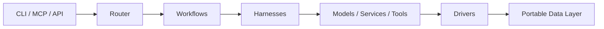

# LocalFabric

<!-- PROJECT_TAGLINE_START -->
**Local-first AI orchestration for models, tools, workflows, and data services.**
<!-- PROJECT_TAGLINE_END -->

LocalFabric is a modular platform for building private, reproducible AI workflows that run on local infrastructure first and can extend to cloud providers when needed. It brings model routing, reusable tools, workflow execution, service orchestration, storage drivers, prompt assets, and auditability into one responsibility-driven workspace.

## Why LocalFabric

AI applications quickly accumulate provider-specific integrations, disconnected scripts, and operational state that is difficult to reproduce. LocalFabric gives teams a structured foundation to:

- Route work across local and remote model providers behind clear interfaces.
- Operate services such as Ollama, vector stores, and databases from a portable runtime.
- Compose image, research, retrieval, and document workflows from reusable capabilities.
- Store persistent artifacts and service state in discoverable, filesystem-backed locations.
- Audit and remediate architecture boundary violations as the codebase evolves.

## Platform Capabilities

| Capability | What It Provides |
| --- | --- |
| Model execution | Harness-based access to local and cloud model surfaces. |
| Workflow orchestration | Multi-step workflows implemented through LangGraph, shell, and YAML patterns. |
| Tool integration | Reusable tools for documents, images, vision, embeddings, research, and related tasks. |
| Service runtime | Docker Compose-backed execution of local infrastructure services. |
| Storage and retrieval | Structured data roots and storage drivers for files, databases, and vector stores. |
| Agent exposure | CLI and MCP surfaces for operators and agent-driven execution. |
| Architecture governance | JSONL audit findings and remediation workflows for responsibility classification. |

## Architecture At A Glance



## Core Documentation

| Document | Purpose |
| --- | --- |
| [Architecture](ARCHITECTURE.md) | System layers, execution flow, contracts, design principles, and extension model. |
| [Data Model](DATA_MODEL.md) | Persistent data layout, addressing model, service mappings, and driver responsibilities. |
| [Repository Structure](REPO_STRUCTURE.md) | Canonical numbered classifications, ownership rules, and migration guidance. |
| [Services](SERVICES.md) | Service runtime design, service categories, state model, and operational interface. |
| [Collaboration](COLLABORATION.md) | Agent worktrees, branch naming, pull request requirements, and integration rules. |
| [Classification Audit](18_docs/classification_audit.md) | Automated checks for cross-classification responsibility leaks. |
| [Remediation Workflow](18_docs/classification_remediation_workflow.md) | Agent workflow for resolving findings safely and iteratively. |

## Repository Layout

Implementation lives directly under the repo root in numeric-prefixed responsibility buckets. Each bucket owns a single concern.

<!-- BUCKETS_TABLE_START -->
| Bucket | Role | Import name |
|--------|------|-------------|
| [`00_specs/`](00_specs/) | Agent-ready specs and task artifacts | — |
| [`01_interfaces/`](01_interfaces/) | Python Protocol mirrors of the JSON schemas | `interfaces` |
| [`01_schemas/`](01_schemas/) | Shared JSON schemas used across components | — |
| [`02_core/`](02_core/) | Shared primitives: config, logging, paths | `core` |
| [`03_adapters/`](03_adapters/) | Interface translation (CLI, REST, OpenAI-compat, MCP) | `adapters` |
| [`04_harnesses/`](04_harnesses/) | Execution lifecycle per provider | `harnesses` |
| [`05_router/`](05_router/) | Classification → scoring → dispatch | `router` |
| [`06_workflows/`](06_workflows/) | LangGraph, LangChain, shell, YAML workflows | `workflows` |
| [`07_tasks/`](07_tasks/) | Atomic task implementations (image, pdf, vision, embeddings, …) | `tasks` |
| [`08_drivers/`](08_drivers/) | Storage/database connectors | `drivers` |
| [`09_services/`](09_services/) | Docker-Compose service catalog by category | — |
| [`10_service_runtime/`](10_service_runtime/) | `cmd <service> <path>` runtime | `service_runtime` |
| [`11_mcp/`](11_mcp/) | MCP servers and exposure shims | `mcp_servers` |
| [`12_prompts/`](12_prompts/) | Prompt templates | — |
| [`13_models/`](13_models/) | Per-model YAML registry (providers + features) | — |
| [`13_providers/`](13_providers/) | Per-provider YAML registry (protocols + endpoints) | — |
| [`14_data/`](14_data/) | Persistent data (filesystem-backed) | — |
| [`15_notebooks/`](15_notebooks/) | Exploration notebooks | — |
| [`16_tests/`](16_tests/) | Integration and contract tests | — |
| [`17_scripts/`](17_scripts/) | Utility and maintenance scripts | — |
| [`18_docs/`](18_docs/) | Supporting docs | — |
| [`19_archive/`](19_archive/) | Deprecated components | — |
<!-- BUCKETS_TABLE_END -->

## Import-name Strategy

Numeric prefixes are filesystem-only — Python forbids module names that start with a digit. The buckets are registered with clean import names via two synchronized mechanisms:

- **[`pyproject.toml`](pyproject.toml)** — `[tool.setuptools.package-dir]` maps each bucket to its import name. `pip install -e .` writes the aliases into a `.pth` file in site-packages so `from harnesses.base import Harness` resolves naturally.
- **[`conftest.py`](conftest.py)** — registers the same aliases at pytest startup so the test suite runs without an install step.

`11_mcp/` is intentionally exposed as **`mcp_servers`**, not `mcp`: [`11_mcp/server.py`](11_mcp/server.py) imports `from mcp.server.fastmcp import FastMCP` (the PyPI MCP SDK), so we leave that top-level name unshadowed.

Always import via the clean name (`from drivers.sql.session import init_db`), never via the numeric path.

## Console Scripts

<!-- CLI_COMMANDS_START -->
| Command | Entry point |
|---------|-------------|
| `localfabric` | `adapters.cli.main:app` |
| `localfabric-md` | `adapters.cli.markdown_runtime_adapter:main` |
| `localfabric-runtime` | `service_runtime.cmd:main` |
<!-- CLI_COMMANDS_END -->

## Getting Started

```bash
pip install -e .
pip install -e ".[dev]"           # adds pytest, ruff, mypy
pytest
python -m adapters.cli.main --help
```

Run a local service through the service runtime:

```bash
python -m service_runtime.cmd up ollama ./14_data/apps/ollama/main
```

Expose available integrations through MCP:

```bash
python -m mcp_servers.server
```

## Notes for contributors

- Cross-bucket imports use the clean import name (`from drivers.sql.session import init_db`), never the numeric path.
- [`core.paths.REPO_ROOT`](02_core/paths.py) is the canonical anchor for path resolution — no `os.path.join(__file__, "..", "..")` patterns anywhere else.
- [`17_scripts/audit_classifications.py`](17_scripts/audit_classifications.py) checks for layer-boundary violations; run it before opening a PR. Findings land at `14_data/runs/classification_audit/`.

## Design Principles

- **Local-first, hybrid-ready:** Prefer private local execution while allowing cloud provider integrations.
- **Provider-agnostic orchestration:** Keep workflows independent from specific model or storage implementations.
- **Clear ownership boundaries:** Classify functionality by responsibility and audit drift automatically.
- **Portable persistent state:** Make services and artifacts relocatable through filesystem-backed data paths.
- **Reproducible operation:** Favor explicit contracts, deterministic configuration, and focused validation.

## Project Status

LocalFabric is an evolving orchestration workspace for local AI applications, service-backed tools, retrieval, and agent integrations. The classification audit and remediation workflow provide a repeatable way to preserve the architecture as new capabilities are added.
