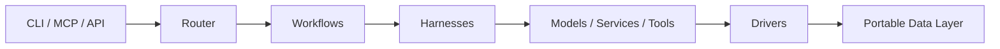

# LocalFabric

**Local-first AI orchestration for models, tools, workflows, and data services.**

LocalFabric is a modular platform for building private, reproducible AI workflows that run on local infrastructure first and can extend to cloud providers when needed. It brings model routing, reusable tools, workflow execution, service orchestration, storage drivers, prompt assets, and auditability into one responsibility-driven workspace.

## Why LocalFabric

AI applications quickly accumulate provider-specific integrations, disconnected scripts, and operational state that is difficult to reproduce. LocalFabric gives teams a structured foundation to:

- Route work across local and remote model providers behind clear interfaces.
- Operate services such as Ollama, vector stores, and databases from a portable runtime.
- Compose image, research, retrieval, and document workflows from reusable capabilities.
- Store persistent artifacts and service state in discoverable, filesystem-backed locations.
- Audit and remediate architecture boundary violations as the codebase evolves.

## Platform Capabilities

| Capability | What It Provides |
| --- | --- |
| Model execution | Harness-based access to local and cloud model surfaces. |
| Workflow orchestration | Multi-step workflows implemented through LangGraph, shell, and YAML patterns. |
| Tool integration | Reusable tools for documents, images, vision, embeddings, research, and related tasks. |
| Service runtime | Docker Compose-backed execution of local infrastructure services. |
| Storage and retrieval | Structured data roots and storage drivers for files, databases, and vector stores. |
| Agent exposure | CLI and MCP surfaces for operators and agent-driven execution. |
| Architecture governance | JSONL audit findings and remediation workflows for responsibility classification. |

## Architecture At A Glance



## Core Documentation

| Document | Purpose |
| --- | --- |
| [Architecture](ARCHITECTURE.md) | System layers, execution flow, contracts, design principles, and extension model. |
| [Data Model](DATA_MODEL.md) | Persistent data layout, addressing model, service mappings, and driver responsibilities. |
| [Repository Structure](REPO_STRUCTURE.md) | Canonical numbered classifications, ownership rules, and migration guidance. |
| [Services](SERVICES.md) | Service runtime design, service categories, state model, and operational interface. |
| [Collaboration](COLLABORATION.md) | Agent worktrees, branch naming, pull request requirements, and integration rules. |
| [Workspace Guide](20_workspaces/README.md) | Implementation buckets, import strategy, commands, and current workspace conventions. |
| [Classification Audit](20_workspaces/18_docs/classification_audit.md) | Automated checks for cross-classification responsibility leaks. |
| [Remediation Workflow](20_workspaces/18_docs/classification_remediation_workflow.md) | Agent workflow for resolving findings safely and iteratively. |

## Repository Overview

The implementation is organized under [`20_workspaces/`](20_workspaces/README.md), with each numbered directory owning a distinct responsibility:

| Area | Responsibility |
| --- | --- |
| Contracts and core | Schemas, protocols, shared primitives, and platform paths. |
| Adapters, harnesses, and routing | Integration boundaries, execution lifecycle, and dispatch. |
| Workflows and tools | Composable product capabilities and reusable task units. |
| Drivers and services | Persistence mechanisms and locally runnable infrastructure. |
| Prompts, models, and data | AI assets, registries, runtime state, and artifacts. |
| Tests, scripts, docs, and archive | Validation, operations, guidance, and retained legacy materials. |

## Getting Started

From the repository root:

```bash
cd 20_workspaces
pip install -e .
pytest
python -m adapters.cli.main --help
```

Run a local service through the service runtime:

```bash
python -m service_runtime.cmd up ollama ./14_data/apps/ollama/main
```

Expose available integrations through MCP:

```bash
python -m mcp_servers.server
```

## Design Principles

- **Local-first, hybrid-ready:** Prefer private local execution while allowing cloud provider integrations.
- **Provider-agnostic orchestration:** Keep workflows independent from specific model or storage implementations.
- **Clear ownership boundaries:** Classify functionality by responsibility and audit drift automatically.
- **Portable persistent state:** Make services and artifacts relocatable through filesystem-backed data paths.
- **Reproducible operation:** Favor explicit contracts, deterministic configuration, and focused validation.

## Project Status

LocalFabric is an evolving orchestration workspace for local AI applications, service-backed tools, retrieval, and agent integrations. The classification audit and remediation workflow provide a repeatable way to preserve the architecture as new capabilities are added.
